# Architecture diagrams

Beginner-friendly pictures of how memory-graph is built and how it behaves. Every name, number and step comes from [ADR 0001](adr/0001-storage.md), [ADR 0002](adr/0002-parsing-and-crate-layout.md), [ADR 0003](adr/0003-data-model.md), the [data-model spike](spikes/data-model.md) and the current code in `crates/`. If a diagram and an ADR ever disagree, the ADR wins.

## Legend

- **"Built today" means `main` as of commit 5bedd03** (ADR 0001, ADR 0002, the code in `crates/`, including story 0: the `describe` catalog and `schema_version` 2). Where a diagram still shows the older behaviour (a `describe` scan of every token), it is labelled as the state before story 0 or as a measured baseline.
- **In a diagram with "Proposed" in its title, every line and box is proposed**; line style there only separates different kinds of edge (stated under each diagram). In a mixed diagram, dashed lines / dashed boxes = proposed or not decided. ADR 0003 is **Proposed** (not accepted). Diagram 15's right side and diagrams 14 and 17 reflect the user's decisions of 2026-09-20 on Q4 and Q5 (recorded in ADR 0003 and the [Q4/Q5 decision paper](spikes/q4-q5-decision-paper.md)): the daemon path is **decided, not built**; sharding has a **decided key, build deferred**. The ADR itself is still not accepted.
- Sizes: **[M]** measured, **[E]** estimated (same tags as the ADR).

## Index

Data model first, because it is the heart of the design.

1. [Data model, current (v1): every token is a node](#1-data-model-current-v1-every-token-is-a-node)
2. [Data model, proposed (v2): streams, dictionary, postings](#2-data-model-proposed-v2-streams-dictionary-postings)
3. [One source line, stored both ways](#3-one-source-line-stored-both-ways)
4. [Side by side: 525 B versus about 21 B per token](#4-side-by-side-525-b-versus-about-21-b-per-token)
5. [System overview: crates and dependencies](#5-system-overview-crates-and-dependencies)
6. [Ingest of one file (today)](#6-ingest-of-one-file-today)
7. [Directory index with the fingerprint skip (today)](#7-directory-index-with-the-fingerprint-skip-today)
8. [Search with roll-up by grain](#8-search-with-roll-up-by-grain)
9. [describe and filter validation](#9-describe-and-filter-validation)
10. [Snapshot open, pin and retry (proposed)](#10-snapshot-open-pin-and-retry-proposed)
11. [Chunked ingest with batch_id (proposed)](#11-chunked-ingest-with-batch_id-proposed)
12. [Crash recovery and manifest states (proposed)](#12-crash-recovery-and-manifest-states-proposed)
13. [Crash and repair sequence (proposed)](#13-crash-and-repair-sequence-proposed)
14. [Sharding layout and search fan-out (key decided, build deferred)](#14-sharding-layout-and-search-fan-out-key-decided-build-deferred)
15. [Cross-process access: today versus the decided daemon](#15-cross-process-access-today-versus-the-decided-daemon)
16. [Versioning and migration (proposed)](#16-versioning-and-migration-proposed)
17. [Delivery roadmap: ADR 0003 stories](#17-delivery-roadmap-adr-0003-stories)

---

## 1. Data model, current (v1): every token is a node

**Built today (ADR 0001).** Everything is a `Node` row in one redb file. Containment is org > repo > file > symbol > token, and each node stores its `parent`, so "who contains this?" is one lookup. Helper tables make lookups fast.

**How to read it:** boxes are node kinds (fields from `crates/graph-core/src/schema.rs`); an arrow means "contains", stored as the child's `parent` id. A token is a whole JSON node, about 248 B, every time it occurs. The bottom box lists the tables.

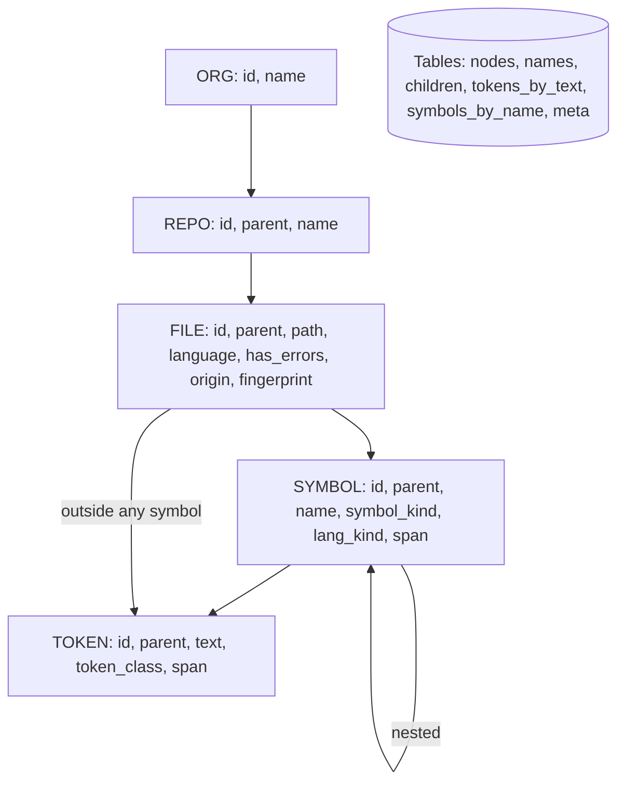
```mermaid
flowchart TD
    ORG["ORG: id, name"] --> REPO["REPO: id, parent, name"]
    REPO --> FILE["FILE: id, parent, path, language, has_errors, origin, fingerprint"]
    FILE --> SYM["SYMBOL: id, parent, name, symbol_kind, lang_kind, span"]
    SYM -->|nested| SYM
    SYM --> TOK["TOKEN: id, parent, text, token_class, span"]
    FILE -->|outside any symbol| TOK
    TABLES[("Tables: nodes, names, children, tokens_by_text, symbols_by_name, meta")]
    style TABLES stroke-dasharray: 0
```

Tables (`crates/graph-store/src/lib.rs`): `nodes` (id to node), `names` (parent + kind + name to id), `children` (multimap), `tokens_by_text` (multimap), `symbols_by_name` (the `SYMBOLS` multimap: symbol name to symbol id), `meta` (schema version, `next_id`, and `symbol_index_version`, currently 1, which triggers a rebuild of `symbols_by_name` when it changes).

---

## 2. Data model, proposed (v2): streams, dictionary, postings

**Proposed (ADR 0003, not accepted).** Tokens stop being rows. Each file's tokens are one compact byte **stream**; a **dictionary** turns text into small ids; **postings** count how often each term appears in each piece of content. Files, repos, orgs and symbols stay rows, and the file row carries the counters so `describe` never scans tokens.

**How to read it:** boxes are tables inside one shard (one redb file); the manifest sits outside the shards. TOKEN is deliberately missing: its data lives inside the stream. Solid arrows here are the data relationships; all of it is proposed.

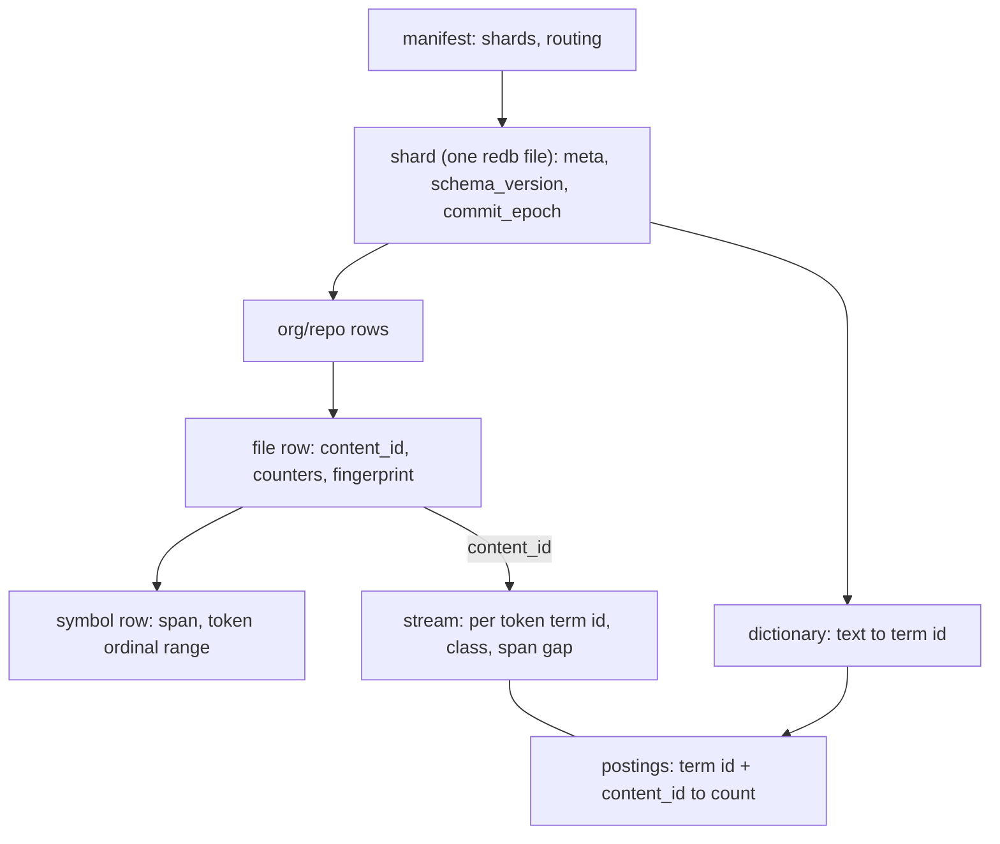
```mermaid
flowchart TD
    MAN["manifest: shards, routing"] --> SHARD["shard (one redb file): meta, schema_version, commit_epoch"]
    SHARD --> ROWS["org/repo rows"] --> FILE["file row: content_id, counters, fingerprint"]
    FILE --> SYM["symbol row: span, token ordinal range"]
    FILE -->|content_id| STREAM["stream: per token term id, class, span gap"]
    SHARD --> DICT["dictionary: text to term id"]
    DICT --> POST["postings: term id + content_id to count"]
    STREAM --- POST
```

Other v2 tables (ADR 0003): `meta`, `names` (`parent \0 kind \0 name` to id), `refs` (`content_id` to refcount), `content_files` (`content_id` to file ids). The file row counters are `token_count`, `symbol_count`, per-class and per-symbol-kind counts. `symbols_by_name` already exists in v1 (diagram 1) and carries over as a derived table, rebuilt when `derived_version` (today's `symbol_index_version`) lags. Token ids are synthetic and unstable across re-index.

---

## 3. One source line, stored both ways

**Both models start from the same extractor output.** Take the single line `fn add(a: i32) {}` in file `src/lib.rs`. The extractor reports one symbol (`add`, function) and tokens with spans. The store derives parents from span containment (ADR 0002).

**How to read it:** follow the top box down each side. Left is what is written to disk today; right is what v2 proposes to write. Token counts are illustrative, the shapes are from the ADR.

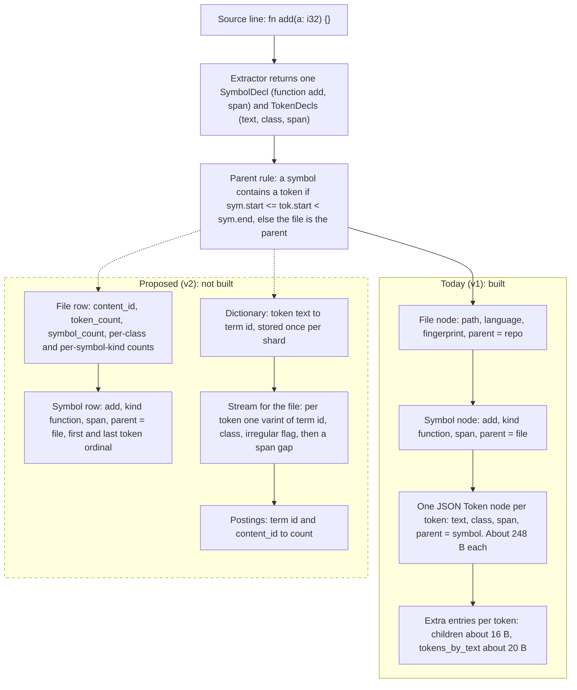
```mermaid
flowchart TD
    SRC["Source line: fn add(a: i32) {}"]
    EX["Extractor returns one SymbolDecl (function add, span) and TokenDecls (text, class, span)"]
    PARENT["Parent rule: a symbol contains a token if sym.start <= tok.start < sym.end, else the file is the parent"]
    SRC --> EX --> PARENT

    subgraph V1["Today (v1): built"]
        direction TB
        A1["File node: path, language, fingerprint, parent = repo"]
        A2["Symbol node: add, kind function, span, parent = file"]
        A3["One JSON Token node per token: text, class, span, parent = symbol. About 248 B each"]
        A4["Extra entries per token: children about 16 B, tokens_by_text about 20 B"]
        A1 --> A2 --> A3 --> A4
    end

    subgraph V2["Proposed (v2): not built"]
        direction TB
        B1["File row: content_id, token_count, symbol_count, per-class and per-symbol-kind counts"]
        B2["Symbol row: add, kind function, span, parent = file, first and last token ordinal"]
        B3["Dictionary: token text to term id, stored once per shard"]
        B4["Stream for the file: per token one varint of term id, class, irregular flag, then a span gap"]
        B5["Postings: term id and content_id to count"]
        B1 --> B2
        B3 --> B4 --> B5
    end

    PARENT --> A1
    PARENT -.-> B1
    PARENT -.-> B3

    style V2 stroke-dasharray: 5 5
```

---

## 4. Side by side: 525 B versus about 21 B per token

**Measured on the spike corpus.** Today a token costs about 525 B of redb pages [M]; the v2 prototype measured 20.8 B per token [M, prototype with per-occurrence postings]. The ADR target after the packed dictionary and block postings is 8-12 B per token [E].

**How to read it:** two different data sets appear, kept in separate boxes. The 241,638-token corpus is the 1x point (525 B/token); the 9.9 M-token set is the 41x point (529 B/token in the ADR table, 525 B in the 1x table: the same cost, measured at two sizes).

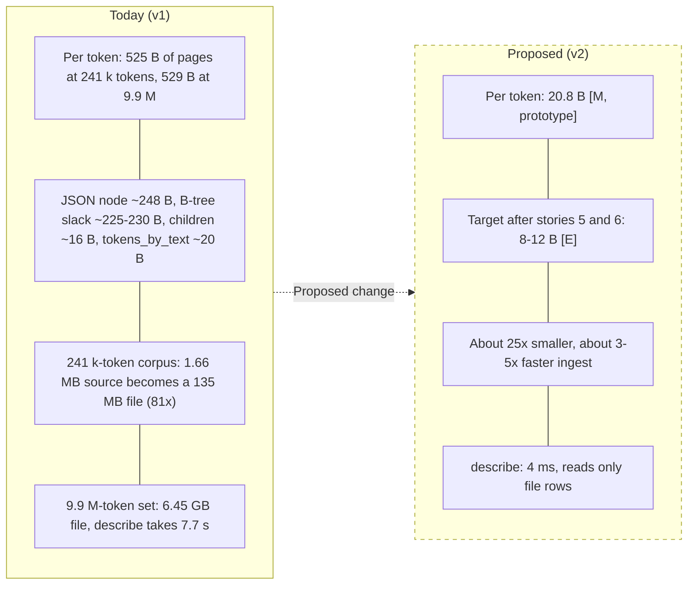
```mermaid
flowchart LR
    subgraph NOW["Today (v1)"]
        direction TB
        N1["Per token: 525 B of pages at 241 k tokens, 529 B at 9.9 M"]
        N2["JSON node ~248 B, B-tree slack ~225-230 B, children ~16 B, tokens_by_text ~20 B"]
        N3["241 k-token corpus: 1.66 MB source becomes a 135 MB file (81x)"]
        N4["9.9 M-token set: 6.45 GB file, describe takes 7.7 s"]
        N1 --- N2 --- N3 --- N4
    end
    subgraph PROP["Proposed (v2)"]
        direction TB
        P1["Per token: 20.8 B [M, prototype]"]
        P2["Target after stories 5 and 6: 8-12 B [E]"]
        P3["About 25x smaller, about 3-5x faster ingest"]
        P4["describe: 4 ms, reads only file rows"]
        P1 --- P2 --- P3 --- P4
    end
    NOW -.->|"Proposed change"| PROP
    style PROP stroke-dasharray: 5 5
```

---

## 5. System overview: crates and dependencies

**Built today.** The workspace (ADR 0002) has a core crate with no storage, a store crate on redb, a CLI, and a language extractor. Arrows point from a crate to a crate it depends on (from the `Cargo.toml` files). Everything is pure Rust; CI enforces it.

**How to read it:** follow arrows downward; `graph-core` depends on nothing in the workspace. Dashed items are decided (Q5, 2026-09-20) but not built.

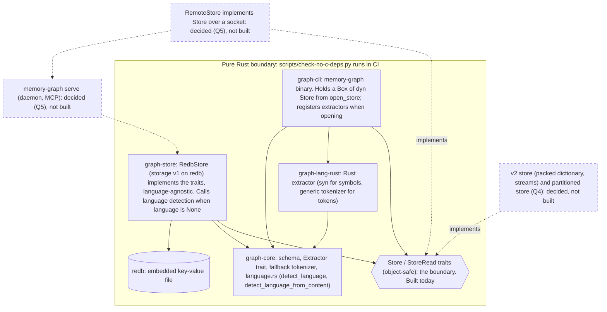
```mermaid
flowchart TD
    subgraph PURE["Pure Rust boundary: scripts/check-no-c-deps.py runs in CI"]
        CLI["graph-cli: memory-graph binary. Holds a Box of dyn Store from open_store; registers extractors when opening"]
        LANG["graph-lang-rust: Rust extractor (syn for symbols, generic tokenizer for tokens)"]
        TRAIT{{"Store / StoreRead traits (object-safe): the boundary. Built today"}}
        STORE["graph-store: RedbStore (storage v1 on redb) implements the traits, language-agnostic. Calls language detection when language is None"]
        CORE["graph-core: schema, Extractor trait, fallback tokenizer, language.rs (detect_language, detect_language_from_content)"]
        REDB[("redb: embedded key-value file")]
        CLI --> TRAIT
        STORE --> TRAIT
        CLI --> LANG
        CLI --> CORE
        STORE --> CORE
        LANG --> CORE
        STORE --> REDB
    end
    SERVE["memory-graph serve (daemon, MCP): decided (Q5), not built"]
    REMOTE["RemoteStore implements Store over a socket: decided (Q5), not built"]
    V2["v2 store (packed dictionary, streams) and partitioned store (Q4): decided, not built"]
    SERVE -.-> STORE
    REMOTE -.->|"implements"| TRAIT
    REMOTE -.-> SERVE
    V2 -.->|"implements"| TRAIT
    style SERVE stroke-dasharray: 5 5
    style REMOTE stroke-dasharray: 5 5
    style V2 stroke-dasharray: 5 5
```

`graph-store` depends only on `graph-core` (and redb, serde, sha2); `graph-lang-rust` is a dev-dependency of the store, used by its tests only. **The store trait (ADR 0003 story 1, built):** `Store` (reads, writes, `snapshot()`) extends the read-only `StoreRead`, so a snapshot handle can answer every read and nothing else. Both are object-safe, so the CLI holds a `Box<dyn Store>` picked by `open_store(Backend, path, extractors)` (only `Backend::Redb` exists) and never names the redb type. `Store` is `Send + Sync` (the extractor registry is now `Send + Sync`) so a daemon can share it; snapshots are `Send`. Nothing in the traits names a file or shard, so a v2 store, a partitioned store (Q4) and `RemoteStore` (Q5) can implement them later. The CLI registers the Rust extractor when it opens the store; languages without an extractor use the fallback tokenizer. A reusable conformance suite (`graph_store::conformance`) runs the shared store behaviours against any implementation; it currently runs against redb and is the seed of the differential oracle. Language detection lives in `graph-core/src/language.rs`, not in the CLI: on directory runs the CLI passes `language: None` and the store detects it from path and content.

---

## 6. Ingest of one file (today)

**Built today.** `memory-graph index-file` (single file) sends one file to the store; the store detects the language when none is given, picks the extractor and turns the output into rows. The store, not the extractor, works out parents from span containment. Directory runs use the same steps through `index_batch` (diagram 7).

**How to read it:** time flows downward. This is the **single-file path** (`index_bytes`, one write transaction per file). The fingerprint is computed before the write transaction opens.

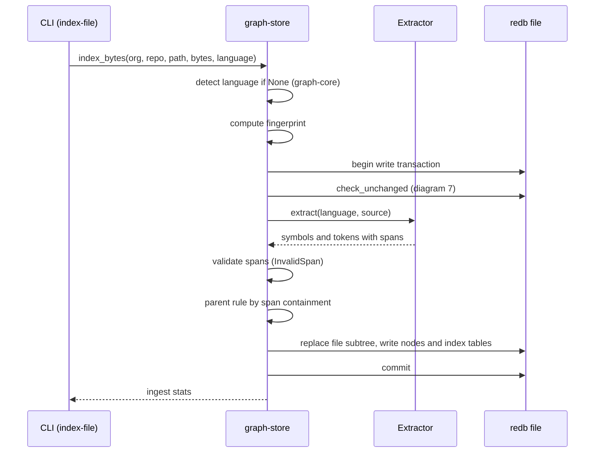
```mermaid
sequenceDiagram
    participant CLI as CLI (index-file)
    participant Store as graph-store
    participant Reg as Extractor
    participant redb as redb file
    CLI->>Store: index_bytes(org, repo, path, bytes, language)
    Store->>Store: detect language if None (graph-core)
    Store->>Store: compute fingerprint
    Store->>redb: begin write transaction
    Store->>redb: check_unchanged (diagram 7)
    Store->>Reg: extract(language, source)
    Reg-->>Store: symbols and tokens with spans
    Store->>Store: validate spans (InvalidSpan)
    Store->>Store: parent rule by span containment
    Store->>redb: replace file subtree, write nodes and index tables
    Store->>redb: commit
    Store-->>CLI: ingest stats
```

Parent rule in short: symbols sorted by start then longer first, merged with tokens by start; a symbol wins ties; a token outside every symbol has the file as parent.

---

## 7. Directory index with the fingerprint skip (today)

**Built today (PR #8).** `memory-graph index <dir>` collects files and hands them to `flush_batch` in `main.rs`, which calls `Store::index_batch`: **one write transaction for many files**, language `None` so the store detects it. Each file has a fingerprint; if it equals the stored one the subtree is not touched and only `origin` is refreshed.

**How to read it:** order per file is fingerprint, then (inside the already-open write transaction) `check_unchanged`, then extract, then write. The fingerprint is a sha256 of bytes, lowercased language, `Extractor::version()` and `FINGERPRINT_FORMAT_VERSION`. The single-file path (diagram 6) does the same steps with one file per transaction.

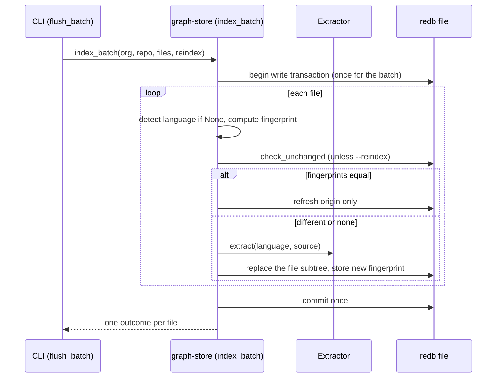
```mermaid
sequenceDiagram
    participant CLI as CLI (flush_batch)
    participant Store as graph-store (index_batch)
    participant Reg as Extractor
    participant redb as redb file
    CLI->>Store: index_batch(org, repo, files, reindex)
    Store->>redb: begin write transaction (once for the batch)
    loop each file
        Store->>Store: detect language if None, compute fingerprint
        Store->>redb: check_unchanged (unless --reindex)
        alt fingerprints equal
            Store->>redb: refresh origin only
        else different or none
            Store->>Reg: extract(language, source)
            Store->>redb: replace the file subtree, store new fingerprint
        end
    end
    Store->>redb: commit once
    Store-->>CLI: one outcome per file
```

Non-UTF-8 or oversized files give a per-file error and are not stored; a file whose extraction fails span validation (`InvalidSpan`) is reported as failed with its path and reason and is not stored (other files in the batch still are; `index` exits non-zero and skips `--prune`); a storage error aborts the whole batch. `index --prune` removes only files marked `origin = directory`; `index-file` files are never pruned unless a directory run re-indexes them.

---

## 8. Search with roll-up by grain

**Built today for v1, proposed for v2.** A search by exact text can report hits at token, symbol, file, repo or org grain (a "roll-up" groups hits by ancestor and counts them). In v1 each hit and each ancestor is a decoded JSON node; in v2 the file/repo/org grains read only the `(term, content_id) -> count` postings and never decode a stream.

**How to read it:** the two `alt` branches are the two designs. In v1 every matching token and its ancestors are loaded before language/org/repo filters apply; only v2 filters by language first. In v2, token and symbol grain (or class filters) still decode the streams of files that have postings. Order is deterministic: `(org, repo, file path, start_byte, ordinal)`.

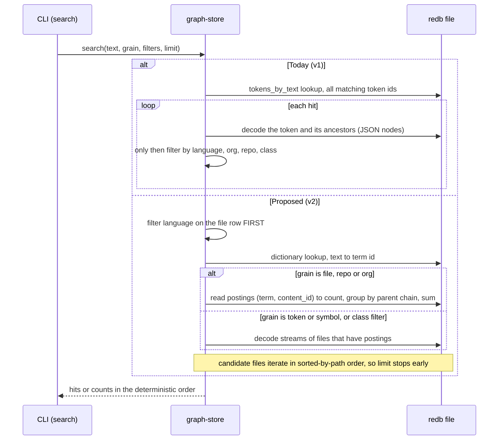
```mermaid
sequenceDiagram
    participant CLI as CLI (search)
    participant Store as graph-store
    participant redb as redb file
    CLI->>Store: search(text, grain, filters, limit)
        alt Today (v1)
        Store->>redb: tokens_by_text lookup, all matching token ids
        loop each hit
            Store->>redb: decode the token and its ancestors (JSON nodes)
            Store->>Store: only then filter by language, org, repo, class
        end
    else Proposed (v2)
        Store->>Store: filter language on the file row FIRST
        Store->>redb: dictionary lookup, text to term id
        alt grain is file, repo or org
            Store->>redb: read postings (term, content_id) to count, group by parent chain, sum
        else grain is token or symbol, or class filter
            Store->>redb: decode streams of files that have postings
        end
        Note over Store,redb: candidate files iterate in sorted-by-path order, so limit stops early
    end
    Store-->>CLI: hits or counts in the deterministic order
```

Measured for `(` at 9.9 M tokens [M]: org grain 2,409 ms today versus 6.5 ms with postings; token grain 11,261 ms versus 588 ms.

---

## 9. describe and filter validation

**Story 0 (PR #12, on main at 5bedd03) removed the scan; v2 keeps it removed.** "Built today" is `main` at 5bedd03. Every CLI `search` or `symbols` first runs `validate_filters`, which rejects empty `--org`, `--repo`, `--language` and `--kind/--symbol-kind` values, calls `describe`, then checks that org/repo match something indexed, the language is present, and the kind is known. Before story 0, `describe` was O(tokens): about 134 ms of the ~215-261 ms per CLI call on the corpus DB [M]. Now it reads the `catalog` table (corpus 241 k tokens, p50: `search '('` 239 to 89 ms, `symbols new` 202 to 2 ms, `describe` 200 to 2 ms [M]).

**How to read it:** three separate steps, not one. (1) before story 0 (main at 4ed7f41), (2) today: story 0, on main at 5bedd03, with `schema_version` 2, (3) v2, proposed. Story 0's `catalog` table is per repo and language; v2's counters are per file. They are different things.

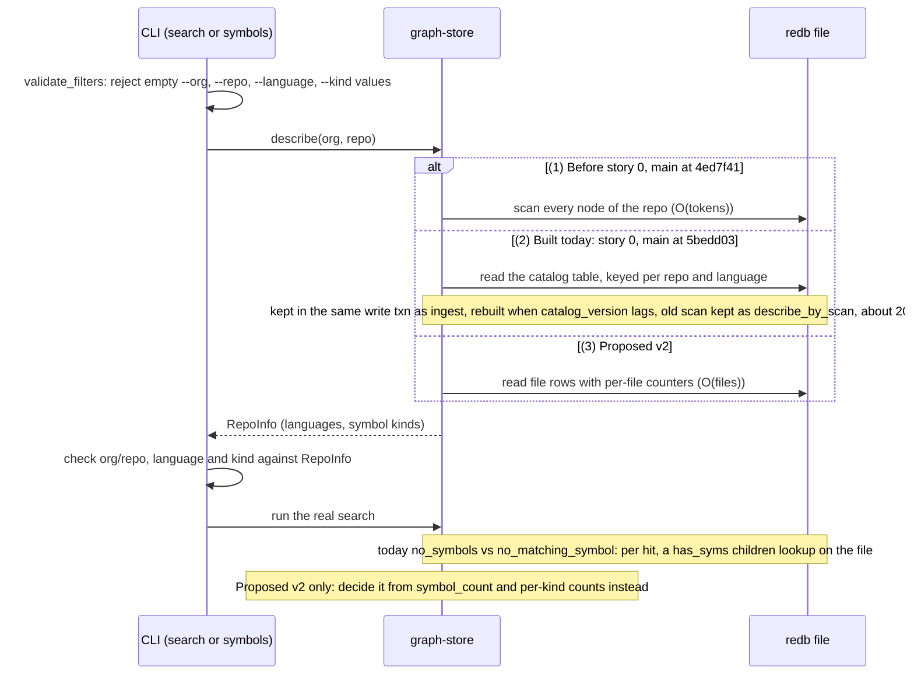
```mermaid
sequenceDiagram
    participant CLI as CLI (search or symbols)
    participant Store as graph-store
    participant redb as redb file
    CLI->>CLI: validate_filters: reject empty --org, --repo, --language, --kind values
    CLI->>Store: describe(org, repo)
    alt (1) Before story 0, main at 4ed7f41
        Store->>redb: scan every node of the repo (O(tokens))
    else (2) Built today: story 0, main at 5bedd03
        Store->>redb: read the catalog table, keyed per repo and language
        Note over Store,redb: kept in the same write txn as ingest, rebuilt when catalog_version lags, old scan kept as describe_by_scan, about 200 ms to 2 ms
    else (3) Proposed v2
        Store->>redb: read file rows with per-file counters (O(files))
    end
    Store-->>CLI: RepoInfo (languages, symbol kinds)
    CLI->>CLI: check org/repo, language and kind against RepoInfo
    CLI->>Store: run the real search
    Note over Store,redb: today no_symbols vs no_matching_symbol: per hit, a has_syms children lookup on the file
    Note over Store: Proposed v2 only: decide it from symbol_count and per-kind counts instead
```

---

## 10. Snapshot open, pin and retry (proposed)

**Proposed (ADR 0003, D3).** A reader wants one consistent view across all shards. redb can only open a read transaction on a file's latest committed state, so the reader opens every shard's read transaction eagerly, then checks that each shard's `commit_epoch` matches the manifest. If not, it drops everything and retries.

**How to read it:** the loop is the retry. It gives up after up to 5 s (configurable, jittered backoff from 1 ms) with `SnapshotUnavailable`. A writer that has committed but not yet published a manifest is the usual reason to retry.

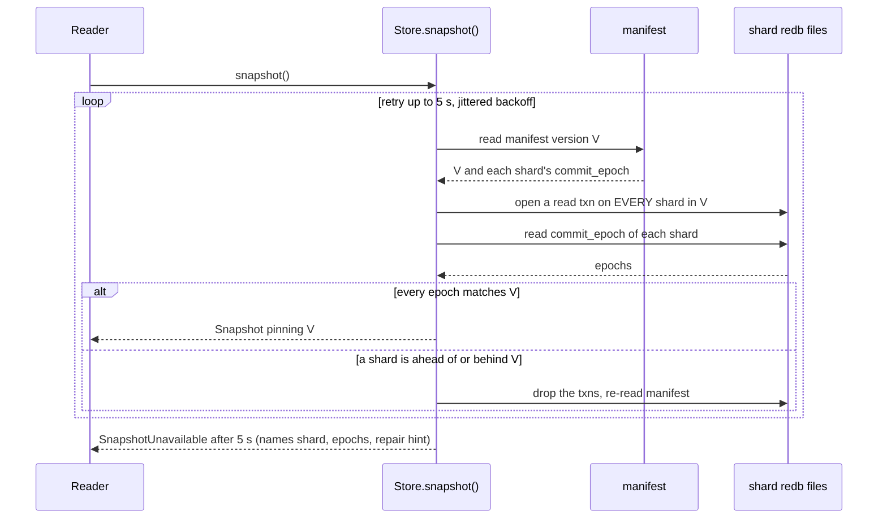
```mermaid
sequenceDiagram
    participant Reader
    participant Store as Store.snapshot()
    participant M as manifest
    participant S as shard redb files
    Reader->>Store: snapshot()
    loop retry up to 5 s, jittered backoff
        Store->>M: read manifest version V
        M-->>Store: V and each shard's commit_epoch
        Store->>S: open a read txn on EVERY shard in V
        Store->>S: read commit_epoch of each shard
        S-->>Store: epochs
        alt every epoch matches V
            Store-->>Reader: Snapshot pinning V
        else a shard is ahead of or behind V
            Store->>S: drop the txns, re-read manifest
        end
    end
    Store-->>Reader: SnapshotUnavailable after 5 s (names shard, epochs, repair hint)
```

Consequences: one open read transaction per shard for the snapshot's whole life; reader-held pages block page reuse and `vacuum` on every shard the snapshot holds. Q6 default (still open): max snapshot age 15 minutes, then `SnapshotExpired`. Within a single shard a snapshot is just a redb read transaction.

---

## 11. Chunked ingest with batch_id (proposed)

**Proposed (ADR 0003).** A big repo index can be several redb commits (chunks, default every 64 MiB). `commit_epoch` is bumped once, at the final chunk. Each file is replaced atomically inside one chunk, but there is **no repo-level atomic visibility**: a reader in the middle sees some files new and some old.

**How to read it:** the writer stamps each chunk with the run's `batch_id` and `meta.open_batch`; a reader takes its snapshot between chunks, passes the epoch check, and sees the repo flagged `in_progress`.

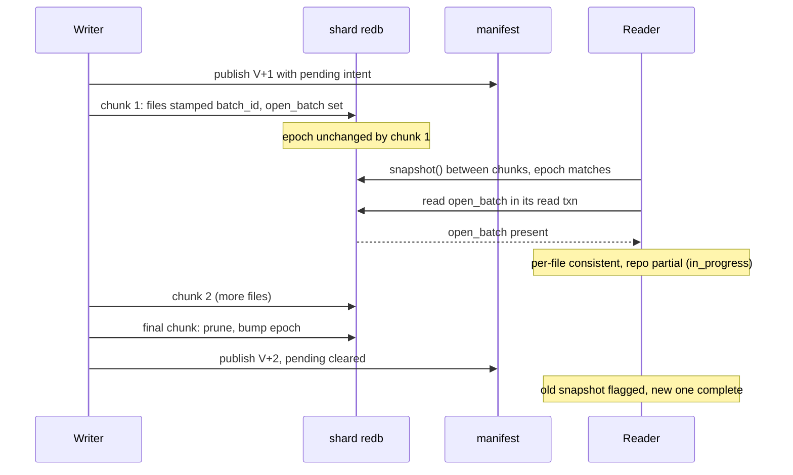
```mermaid
sequenceDiagram
    participant W as Writer
    participant S as shard redb
    participant M as manifest
    participant R as Reader
    W->>M: publish V+1 with pending intent
    W->>S: chunk 1: files stamped batch_id, open_batch set
    Note over S: epoch unchanged by chunk 1
    R->>S: snapshot() between chunks, epoch matches
    R->>S: read open_batch in its read txn
    S-->>R: open_batch present
    Note over R: per-file consistent, repo partial (in_progress)
    W->>S: chunk 2 (more files)
    W->>S: final chunk: prune, bump epoch
    W->>M: publish V+2, pending cleared
    Note over R: old snapshot flagged, new one complete
```

---

## 12. Crash recovery and manifest states (proposed)

**Proposed (ADR 0003).** redb commits are durable and cannot be undone, so rollback is impossible and **recovery always rolls forward**. The writer first publishes a "pending" intent, so after a crash `repair` knows what was meant to happen.

**How to read it:** states describe one shard in the manifest. The normal path is the top row; the crash paths lead to repair. `repair` runs under the exclusive writer lock on writer open and on demand with `memory-graph repair`.

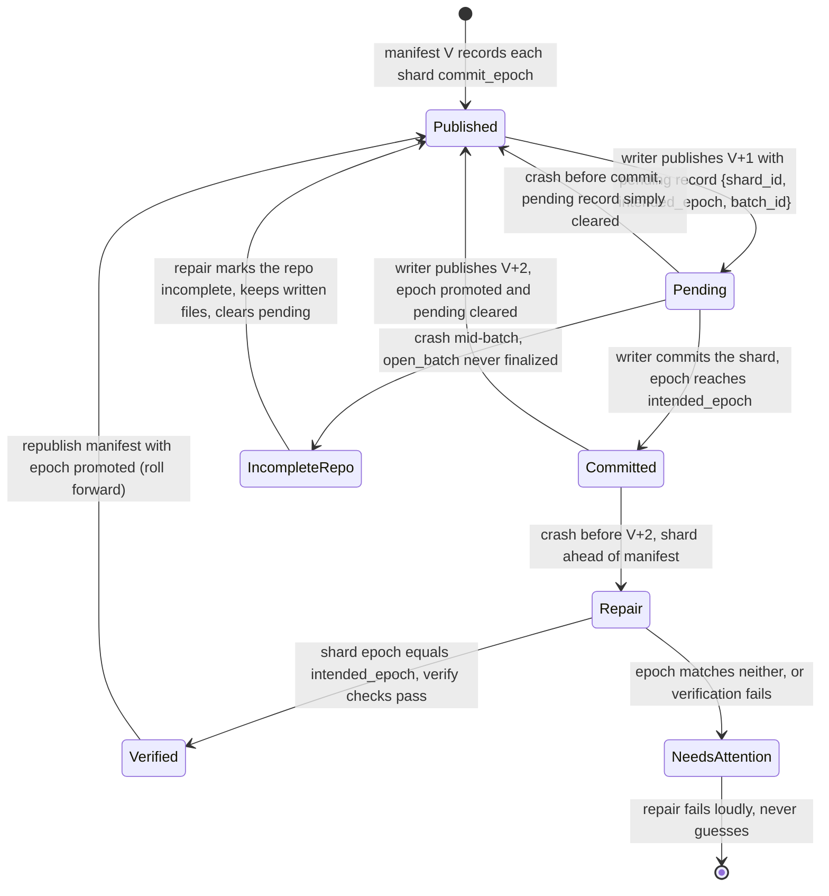
```mermaid
stateDiagram-v2
    [*] --> Published : manifest V records each shard commit_epoch
    Published --> Pending : writer publishes V+1 with pending record {shard_id, intended_epoch, batch_id}
    Pending --> Committed : writer commits the shard, epoch reaches intended_epoch
    Committed --> Published : writer publishes V+2, epoch promoted and pending cleared
    Pending --> Published : crash before commit, pending record simply cleared
    Committed --> Repair : crash before V+2, shard ahead of manifest
    Repair --> Verified : shard epoch equals intended_epoch, verify checks pass
    Verified --> Published : republish manifest with epoch promoted (roll forward)
    Repair --> NeedsAttention : epoch matches neither, or verification fails
    Pending --> IncompleteRepo : crash mid-batch, open_batch never finalized
    IncompleteRepo --> Published : repair marks the repo incomplete, keeps written files, clears pending
    NeedsAttention --> [*] : repair fails loudly, never guesses
```

An `incomplete` repo is resumed by the next `index` run: files whose fingerprint already matches are skipped, and a new batch id finalizes the epoch. `routing_change {repo, from, to}` (move/rebalance) is applied in V+2 with the epoch promotion.

---

## 13. Crash and repair sequence (proposed)

**Proposed (ADR 0003, story 14).** What actually happens, step by step, when a writer dies between committing a shard and publishing the manifest.

**How to read it:** the reader never repairs; it only reports the hint. Repair is idempotent and only publishes through the atomic manifest rename.

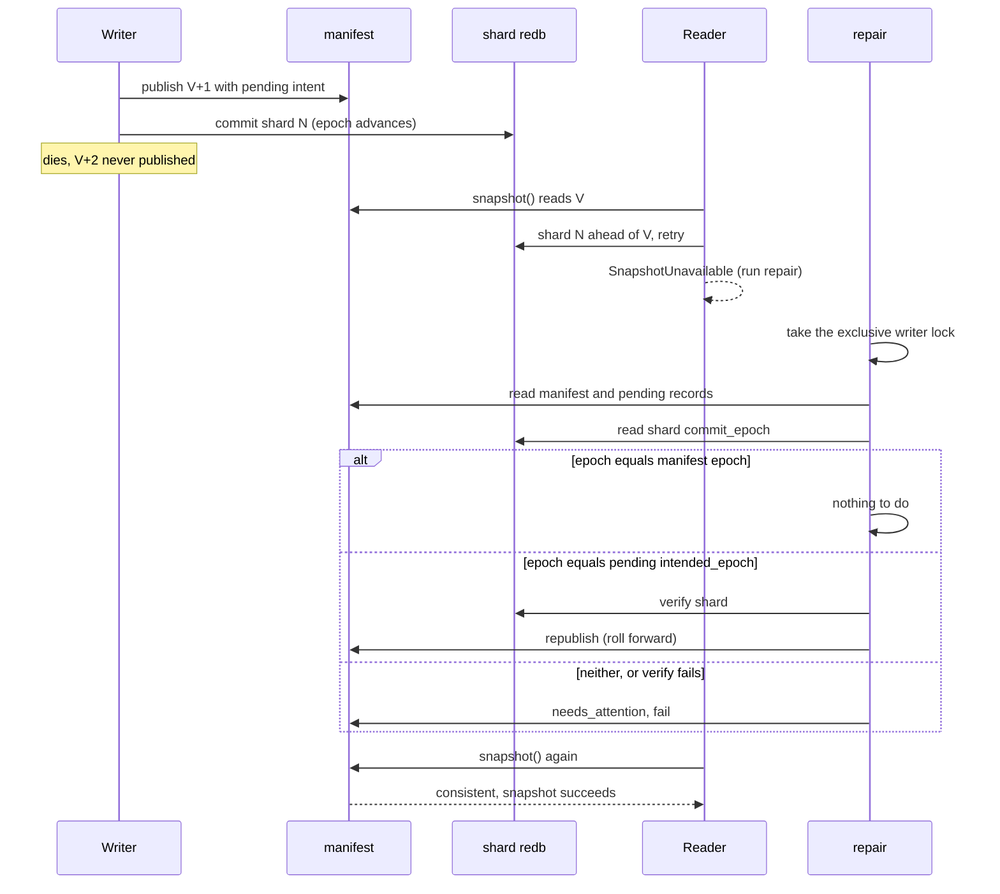
```mermaid
sequenceDiagram
    participant W as Writer
    participant M as manifest
    participant S as shard redb
    participant R as Reader
    participant Rep as repair
    W->>M: publish V+1 with pending intent
    W->>S: commit shard N (epoch advances)
    Note over W: dies, V+2 never published
    R->>M: snapshot() reads V
    R->>S: shard N ahead of V, retry
    R-->>R: SnapshotUnavailable (run repair)
    Rep->>Rep: take the exclusive writer lock
    Rep->>M: read manifest and pending records
    Rep->>S: read shard commit_epoch
    alt epoch equals manifest epoch
        Rep->>Rep: nothing to do
    else epoch equals pending intended_epoch
        Rep->>S: verify shard
        Rep->>M: republish (roll forward)
    else neither, or verify fails
        Rep->>M: needs_attention, fail
    end
    R->>M: snapshot() again
    M-->>R: consistent, snapshot succeeds
```

---

## 14. Sharding layout and search fan-out (key decided, build deferred)

**Specified; key decided, build deferred (ADR 0003, Q4 decided 2026-09-20; stories 13-17).** The partition key and id layout are fixed now; stories 14-17 are built only after the measured 100 M run (story 6) and the story 13 spike show the single-file ceiling. A shard is one redb file holding whole repos (partition key `(org, repo)`: an org may span shards, a repo never does). Each shard has its own dictionary, streams, postings and rows. A search asks every shard in parallel and merges the answers.

**How to read it:** nothing here is built, so all lines are solid: the top arrows are routing from the manifest, the lower arrows are the search fan-out and merge. The k-way merge uses the same deterministic key as a single shard, so results are identical.

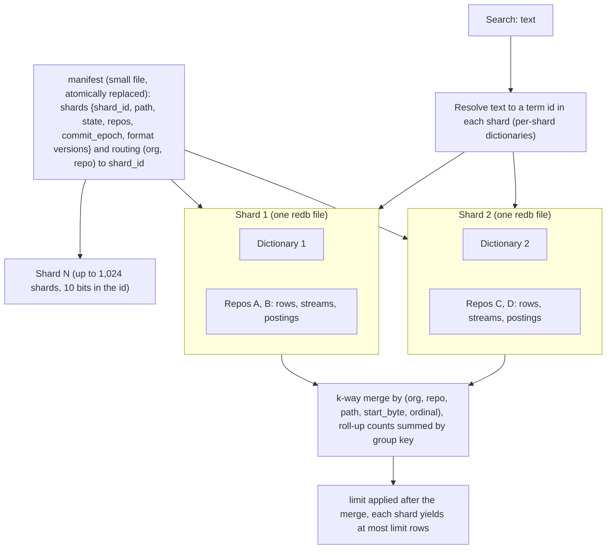
```mermaid
flowchart TD
    MAN["manifest (small file, atomically replaced): shards {shard_id, path, state, repos, commit_epoch, format versions} and routing (org, repo) to shard_id"]
    subgraph SH1["Shard 1 (one redb file)"]
        D1["Dictionary 1"]
        R1["Repos A, B: rows, streams, postings"]
    end
    subgraph SH2["Shard 2 (one redb file)"]
        D2["Dictionary 2"]
        R2["Repos C, D: rows, streams, postings"]
    end
    SHN["Shard N (up to 1,024 shards, 10 bits in the id)"]
    MAN --> SH1
    MAN --> SH2
    MAN --> SHN
    Q["Search: text"]
    Q --> T1["Resolve text to a term id in each shard (per-shard dictionaries)"]
    T1 --> SH1
    T1 --> SH2
    SH1 --> MERGE["k-way merge by (org, repo, path, start_byte, ordinal), roll-up counts summed by group key"]
    SH2 --> MERGE
    MERGE --> LIM["limit applied after the merge, each shard yields at most limit rows"]
```

Ids (ADR): entities `tag(1) | shard(10) | local(53)`; tokens `1 | shard(10) | file_local(28) | ordinal(25)`, emitted as JSON strings. Fan-out routes strictly by the manifest routing table, never by presence. Split threshold example: 200 M tokens or 20 GB (Q4 decided: key `(org, repo)`, one file per shard; the threshold stays tunable). An unavailable shard fails the query unless a partial result is explicitly requested.

---

## 15. Cross-process access: today versus the decided daemon

**First diagram: built today. Second: decided by the user on 2026-09-20 (Q5), not built (ADR story 12a).** redb takes an exclusive `flock(LOCK_EX | LOCK_NB)` on open, so a second process cannot even read while another holds the file; it gets `DatabaseAlreadyOpen`, which `graph-store` reports as `StoreError::Locked`. The user chose (a) an owning daemon with (b) retry as the no-daemon fallback; evidence and alternatives are in the [Q4/Q5 decision paper](spikes/q4-q5-decision-paper.md) and ADR 0003.

**How to read it:** first diagram is today; second is the decided design, where the CLI talks to one owner process and falls back to opening the file itself if none is running.

Today (built):

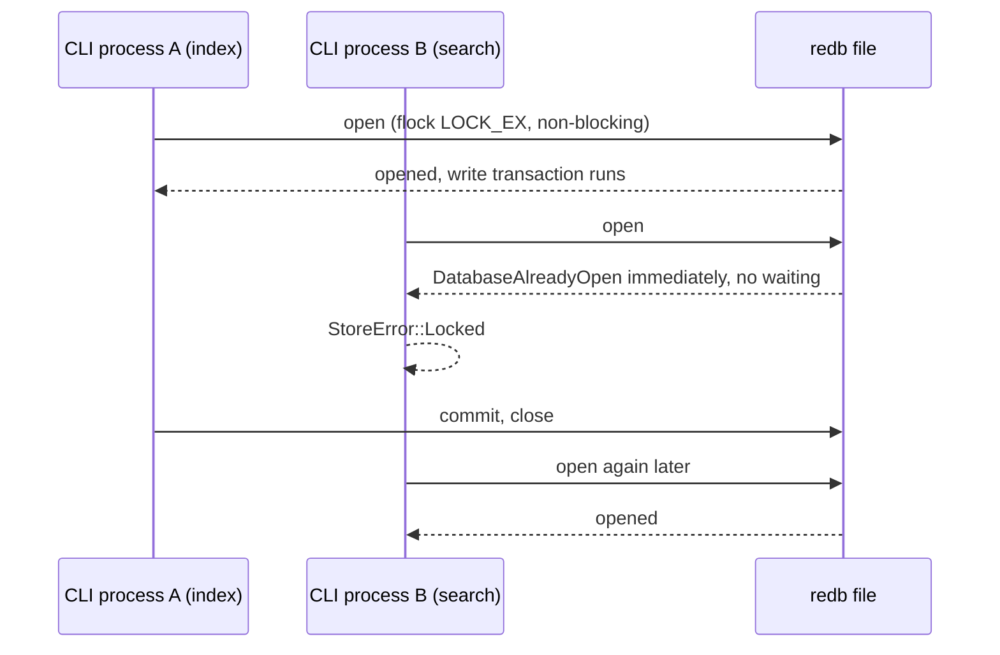
```mermaid
sequenceDiagram
    participant Idx as CLI process A (index)
    participant Srch as CLI process B (search)
    participant redb as redb file
    Idx->>redb: open (flock LOCK_EX, non-blocking)
    redb-->>Idx: opened, write transaction runs
    Srch->>redb: open
    redb-->>Srch: DatabaseAlreadyOpen immediately, no waiting
    Srch-->>Srch: StoreError::Locked
    Idx->>redb: commit, close
    Srch->>redb: open again later
    redb-->>Srch: opened
```

Decided, not built (`memory-graph serve`, socket, `RemoteStore`, fallback):

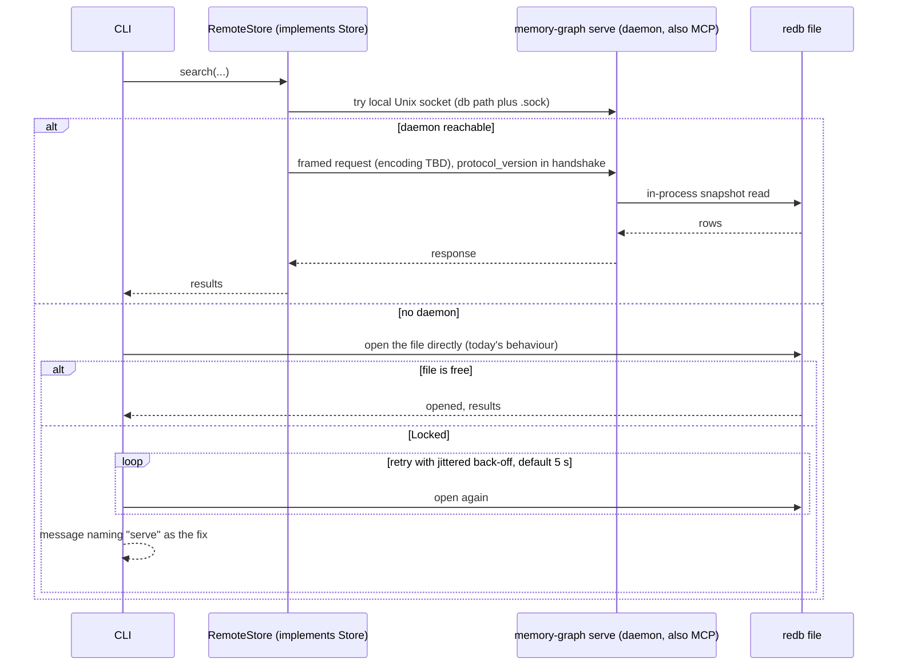
```mermaid
sequenceDiagram
    participant CLI as CLI
    participant Remote as RemoteStore (implements Store)
    participant D as memory-graph serve (daemon, also MCP)
    participant redb as redb file
    CLI->>Remote: search(...)
    Remote->>D: try local Unix socket (db path plus .sock)
    alt daemon reachable
        Remote->>D: framed request (encoding TBD), protocol_version in handshake
        D->>redb: in-process snapshot read
        redb-->>D: rows
        D-->>Remote: response
        Remote-->>CLI: results
    else no daemon
        CLI->>redb: open the file directly (today's behaviour)
        alt file is free
            redb-->>CLI: opened, results
        else Locked
            loop retry with jittered back-off, default 5 s
                CLI->>redb: open again
            end
            CLI-->>CLI: message naming "serve" as the fix
        end
    end
```

Details from the [paper](spikes/q4-q5-decision-paper.md): the daemon holds every shard's exclusive lock, does `repair` on start, and is the MCP server; `RemoteStore` calls the same `Store` trait so the differential oracle stays valid; estimated cost 6-9 days (ADR story 12a, now inside the core total of about 51-56 days). It is revisited only if the daemon adds more than 5 ms at p50 over in-process at 10 M tokens (spike S1), a verified multi-process pure-Rust engine appears (S3), or MCP is dropped. Direct-open with retry gives availability between writes only, not a snapshot guarantee.

---

## 16. Versioning and migration (proposed)

**Proposed (ADR 0003, D2, story 9 and 12).** `schema_version` means the on-disk layout (tables and key encoding) and is checked at open. Components have their own format versions in `meta`. Moving v1 to v2 is `memory-graph migrate`, which writes a new file, verifies it, and only then renames it into place; the source is never modified.

**How to read it:** first the "open" checks, then the migrate run. Any verification failure leaves both source and target untouched. `SCHEMA_VERSION` is 2 in the code today (story 0 added the `describe` catalog; a version-1 file is upgraded in place on open).

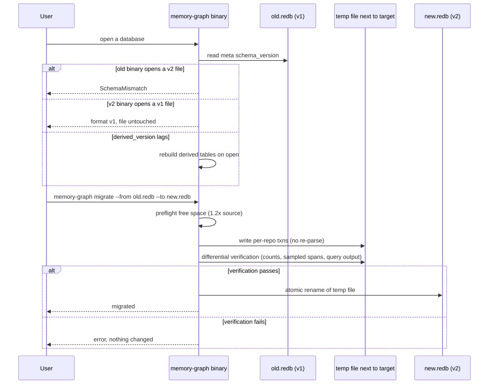
```mermaid
sequenceDiagram
    participant U as User
    participant Bin as memory-graph binary
    participant Src as old.redb (v1)
    participant Tmp as temp file next to target
    participant Dst as new.redb (v2)
    U->>Bin: open a database
    Bin->>Src: read meta schema_version
    alt old binary opens a v2 file
        Bin-->>U: SchemaMismatch
    else v2 binary opens a v1 file
        Bin-->>U: format v1, file untouched
    else derived_version lags
        Bin->>Bin: rebuild derived tables on open
    end
    U->>Bin: memory-graph migrate --from old.redb --to new.redb
    Bin->>Bin: preflight free space (1.2x source)
    Bin->>Tmp: write per-repo txns (no re-parse)
    Bin->>Tmp: differential verification (counts, sampled spans, query output)
    alt verification passes
        Bin->>Dst: atomic rename of temp file
        Bin-->>U: migrated
    else verification fails
        Bin-->>U: error, nothing changed
    end
```

Per-component versions in `meta`: `stream_format`, `postings_format`, `dictionary_format`, `fingerprint_format`, `derived_version` (redefines today's `symbol_index_version`). Estimated 1-2 minutes per 10 M tokens [E]. Export path: `memory-graph export --format ndjson`. The migration framework is a **gate: it must exist and be tested before 1.0 is tagged.**

---

## 17. Delivery roadmap: ADR 0003 stories

**Proposed plan (ADR 0003 story table).** Days are ideal developer-days including tests. The ADR gives the milestone order (story 0, then store trait, then the v2 checkpoint, then packed dictionary and postings) but no full dependency list, so the arrows below are the ADR's stated order plus obvious "needs the thing before it" links; treat them as a reading aid, not ADR text. No arrow links core to sharding, because the ADR does not state one.

**How to read it:** two charts. Everything is proposed. Dashed boxes are optional (18, 19) or deferred and gated (14-17). Totals: core (0-12 and 12a) about 51-56 days, sharding (13-17) 27 days deferred, all together about 84-89 days.

Core chart (stories 0-12 and 12a, plus optional 18 and 19):

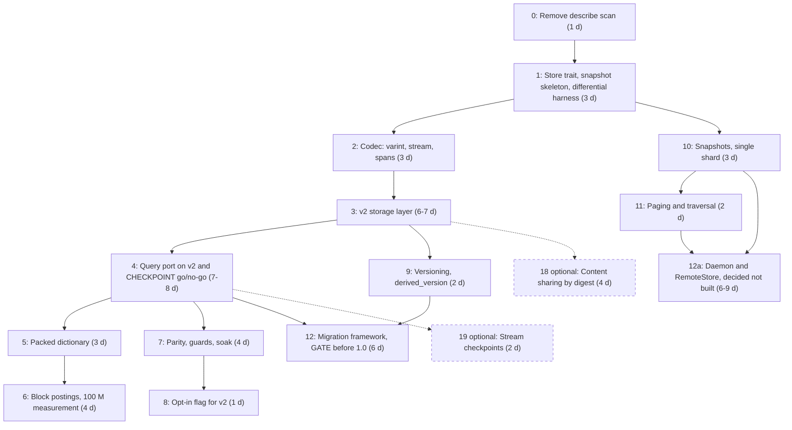
```mermaid
flowchart TD
    S0["0: Remove describe scan (1 d)"]
    S1["1: Store trait, snapshot skeleton, differential harness (3 d)"]
    S2["2: Codec: varint, stream, spans (3 d)"]
    S3["3: v2 storage layer (6-7 d)"]
    S4["4: Query port on v2 and CHECKPOINT go/no-go (7-8 d)"]
    S5["5: Packed dictionary (3 d)"]
    S6["6: Block postings, 100 M measurement (4 d)"]
    S7["7: Parity, guards, soak (4 d)"]
    S8["8: Opt-in flag for v2 (1 d)"]
    S9["9: Versioning, derived_version (2 d)"]
    S10["10: Snapshots, single shard (3 d)"]
    S11["11: Paging and traversal (2 d)"]
    S12["12: Migration framework, GATE before 1.0 (6 d)"]
    S12A["12a: Daemon and RemoteStore, decided not built (6-9 d)"]
    S18["18 optional: Content sharing by digest (4 d)"]
    S19["19 optional: Stream checkpoints (2 d)"]
    S0 --> S1 --> S2 --> S3 --> S4
    S4 --> S5 --> S6
    S4 --> S7 --> S8
    S3 --> S9
    S1 --> S10 --> S11
    S9 --> S12
    S10 --> S12A
    S11 --> S12A
    S4 --> S12
    S3 -.-> S18
    S4 -.-> S19
    style S18 stroke-dasharray: 5 5
    style S19 stroke-dasharray: 5 5
```

Sharding chart (stories 13-17, **key decided, build deferred**: 14-17 start only after the story 6 measured 100 M run and story 13 show the single-file ceiling; dashed boxes are the deferred ones):

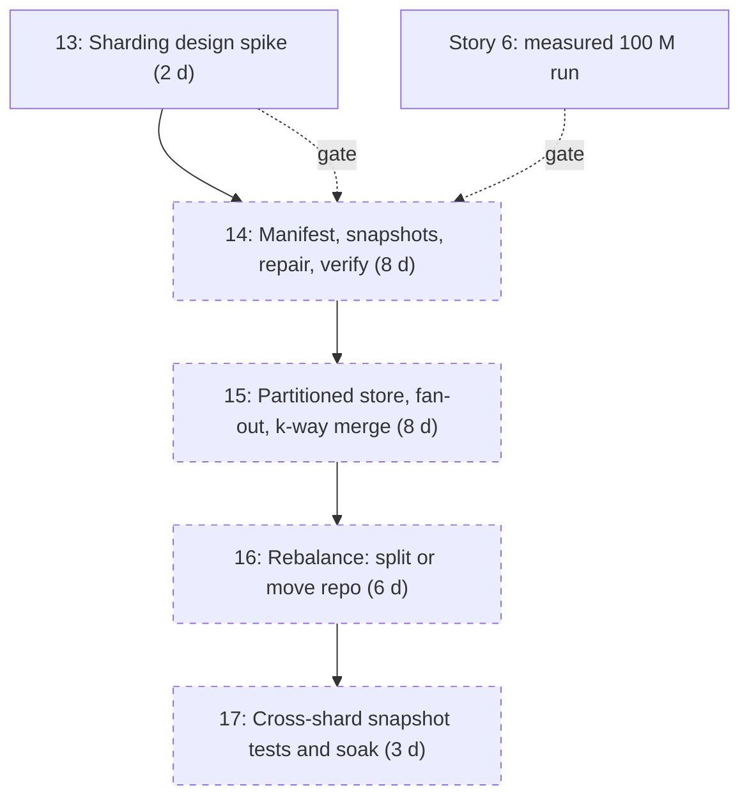
```mermaid
flowchart TD
    S13["13: Sharding design spike (2 d)"]
    S14["14: Manifest, snapshots, repair, verify (8 d)"]
    S15["15: Partitioned store, fan-out, k-way merge (8 d)"]
    S16["16: Rebalance: split or move repo (6 d)"]
    S17["17: Cross-shard snapshot tests and soak (3 d)"]
    S13 --> S14 --> S15 --> S16 --> S17
    S6G["Story 6: measured 100 M run"] -.->|"gate"| S14
    S13 -.->|"gate"| S14
    style S14 stroke-dasharray: 5 5
    style S15 stroke-dasharray: 5 5
    style S16 stroke-dasharray: 5 5
    style S17 stroke-dasharray: 5 5
```

Totals: core 0-12 about 45-47 d (the single-shard re-baseline, stories 0-4, 7, 8, is 25-27 d; stories 5, 6, 9-12 add 20 d) plus the Q5 daemon, story 12a, 6-9 d, gives **51-56 d** (the paper rounds it to about 52-56); sharding 13-17 **27 d**, deferred; with everything (plus 18: 4 d and 19: 2 d) **about 84-89 d**. If the measured 100 M run fits one file, stories 14-17 (25 d) are skipped.
