# Architecture diagrams

Beginner-friendly pictures of how memory-graph is built and how it behaves. Every name, number and step comes from [ADR 0001](adr/0001-storage.md), [ADR 0002](adr/0002-parsing-and-crate-layout.md), [ADR 0003](adr/0003-data-model.md), the [data-model spike](spikes/data-model.md) and the current code in `crates/`. If a diagram and an ADR ever disagree, the ADR wins.

## Legend

- **Solid lines / plain boxes = built today** (ADR 0001, ADR 0002, the code on `main`).
- **Dashed lines / boxes labelled "Proposed" = not built or not decided.** ADR 0003 is **Proposed** (not accepted). Diagrams 12 and 13 come from a Q4/Q5 decision paper that is a recommendation only: **Proposed / awaiting decision**.
- Sizes: **[M]** measured, **[E]** estimated (same tags as the ADR).

## Index

Data model first, because it is the heart of the design.

1. [Data model, current (v1): every token is a node](#1-data-model-current-v1-every-token-is-a-node)
2. [Data model, proposed (v2): streams, dictionary, postings](#2-data-model-proposed-v2-streams-dictionary-postings)
3. [One source line, stored both ways](#3-one-source-line-stored-both-ways)
4. [Side by side: 525 B versus about 21 B per token](#4-side-by-side-525-b-versus-about-21-b-per-token)
5. [System overview: crates and dependencies](#5-system-overview-crates-and-dependencies)
6. [Ingest of one file (today)](#6-ingest-of-one-file-today)
7. [Re-index with the fingerprint skip (today)](#7-re-index-with-the-fingerprint-skip-today)
8. [Search with roll-up by grain](#8-search-with-roll-up-by-grain)
9. [describe and filter validation](#9-describe-and-filter-validation)
10. [Snapshot open, pin and retry (proposed)](#10-snapshot-open-pin-and-retry-proposed)
11. [Chunked ingest with batch_id (proposed)](#11-chunked-ingest-with-batch_id-proposed)
12. [Crash recovery and manifest states (proposed)](#12-crash-recovery-and-manifest-states-proposed)
13. [Crash and repair sequence (proposed)](#13-crash-and-repair-sequence-proposed)
14. [Sharding layout and search fan-out (proposed)](#14-sharding-layout-and-search-fan-out-proposed)
15. [Q5 options: today versus a daemon (proposed / awaiting decision)](#15-q5-options-today-versus-a-daemon-proposed--awaiting-decision)
16. [Versioning and migration (proposed)](#16-versioning-and-migration-proposed)
17. [Delivery roadmap: ADR 0003 stories](#17-delivery-roadmap-adr-0003-stories)

---

## 1. Data model, current (v1): every token is a node

**Built today (ADR 0001).** Everything is a `Node` row in one redb file. Containment is org > repo > file > symbol > token, and each node stores its `parent`, so "who contains this?" is one lookup. Three helper tables (`names`, `children`, `tokens_by_text`) make lookups fast.

**How to read it:** each box is a kind of node; a line labelled "contains" means the child stores the parent's id in its `parent` field. Fields shown are the ones in `crates/graph-core/src/schema.rs`; a token is a whole JSON node, about 248 B, every time it occurs.

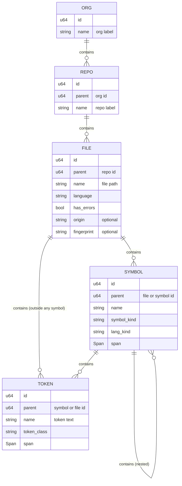
```mermaid
erDiagram
    ORG ||--o{ REPO : contains
    REPO ||--o{ FILE : contains
    FILE ||--o{ SYMBOL : contains
    FILE ||--o{ TOKEN : "contains (outside any symbol)"
    SYMBOL ||--o{ SYMBOL : "contains (nested)"
    SYMBOL ||--o{ TOKEN : contains

    ORG {
        u64 id
        string name "org label"
    }
    REPO {
        u64 id
        u64 parent "org id"
        string name "repo label"
    }
    FILE {
        u64 id
        u64 parent "repo id"
        string name "file path"
        string language
        bool has_errors
        string origin "optional"
        string fingerprint "optional"
    }
    SYMBOL {
        u64 id
        u64 parent "file or symbol id"
        string name
        string symbol_kind
        string lang_kind
        Span span
    }
    TOKEN {
        u64 id
        u64 parent "symbol or file id"
        string name "token text"
        string token_class
        Span span
    }
```

Helper tables (ADR 0001): `nodes` (id to node), `names` (parent + kind + name to id), `children` (multimap), `tokens_by_text` (multimap), `meta` (schema version).

---

## 2. Data model, proposed (v2): streams, dictionary, postings

**Proposed (ADR 0003, not accepted).** Tokens stop being rows. Each file's tokens are one compact byte **stream**; a **dictionary** turns text into small ids; **postings** count how often each term appears in each piece of content. Files, repos, orgs and symbols stay rows, and the file row carries the counters so `describe` never scans tokens.

**How to read it:** boxes are tables inside one shard (one redb file). The `manifest` sits outside the shards and lists them. Note that TOKEN is deliberately missing: its data lives inside the stream.

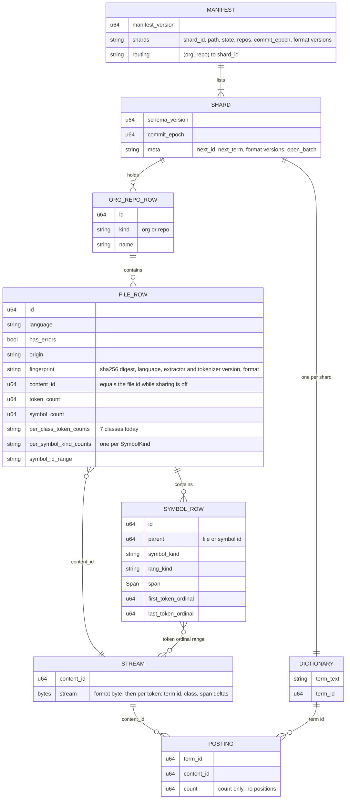
```mermaid
erDiagram
    MANIFEST ||--|{ SHARD : lists
    SHARD ||--o{ ORG_REPO_ROW : holds
    ORG_REPO_ROW ||--o{ FILE_ROW : contains
    FILE_ROW ||--o{ SYMBOL_ROW : contains
    FILE_ROW }o--|| STREAM : "content_id"
    STREAM ||--o{ POSTING : "content_id"
    DICTIONARY ||--o{ POSTING : "term id"
    SHARD ||--|| DICTIONARY : "one per shard"
    SYMBOL_ROW }o--o{ STREAM : "token ordinal range"

    MANIFEST {
        u64 manifest_version
        string shards "shard_id, path, state, repos, commit_epoch, format versions"
        string routing "(org, repo) to shard_id"
    }
    SHARD {
        u64 schema_version
        u64 commit_epoch
        string meta "next_id, next_term, format versions, open_batch"
    }
    ORG_REPO_ROW {
        u64 id
        string kind "org or repo"
        string name
    }
    FILE_ROW {
        u64 id
        string language
        bool has_errors
        string origin
        string fingerprint "sha256 digest, language, extractor and tokenizer version, format"
        u64 content_id "equals the file id while sharing is off"
        u64 token_count
        u64 symbol_count
        string per_class_token_counts "7 classes today"
        string per_symbol_kind_counts "one per SymbolKind"
        string symbol_id_range
    }
    SYMBOL_ROW {
        u64 id
        u64 parent "file or symbol id"
        string symbol_kind
        string lang_kind
        Span span
        u64 first_token_ordinal
        u64 last_token_ordinal
    }
    STREAM {
        u64 content_id
        bytes stream "format byte, then per token: term id, class, span deltas"
    }
    DICTIONARY {
        string term_text
        u64 term_id
    }
    POSTING {
        u64 term_id
        u64 content_id
        u64 count "count only, no positions"
    }
```

Other v2 tables (ADR 0003): `meta`, `names` (`parent \0 kind \0 name` to id), `refs` (`content_id` to refcount), `content_files` (`content_id` to file ids), `symbols_by_name` (name to symbol id). Token ids are synthetic and unstable across re-index.

---

## 3. One source line, stored both ways

**Both models start from the same extractor output.** Take the single line `fn add(a: i32) {}` in file `src/lib.rs`. The extractor reports one symbol (`add`, function) and tokens with spans. The store derives parents from span containment (ADR 0002).

**How to read it:** follow the top box down each side. Left is what is written to disk today; right is what v2 proposes to write. Token counts are illustrative, the shapes are from the ADR.

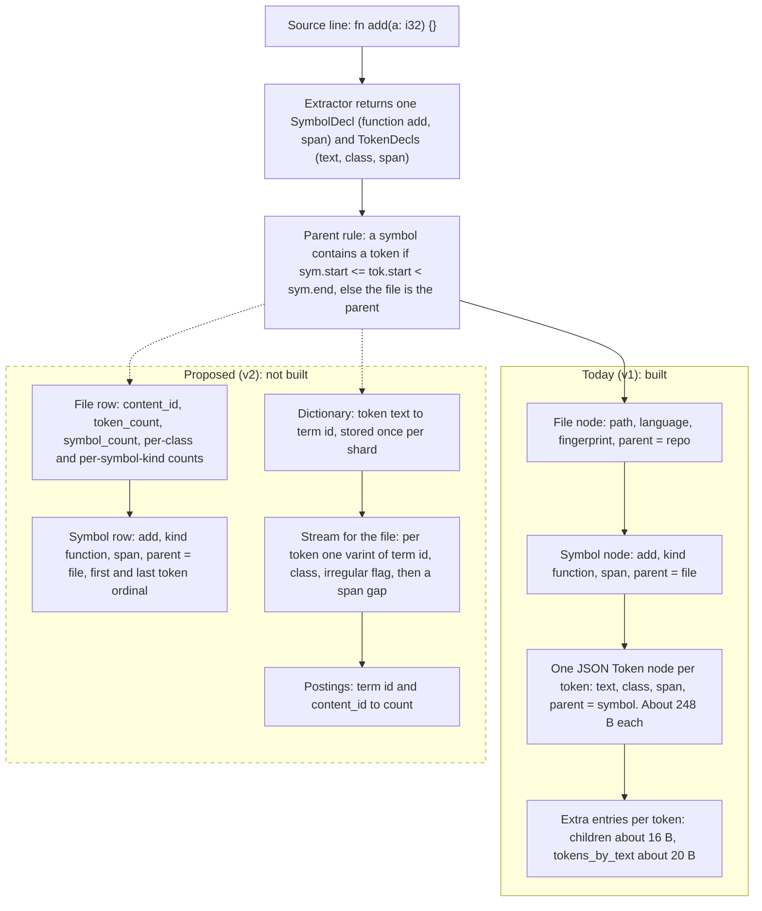
```mermaid
flowchart TD
    SRC["Source line: fn add(a: i32) {}"]
    EX["Extractor returns one SymbolDecl (function add, span) and TokenDecls (text, class, span)"]
    PARENT["Parent rule: a symbol contains a token if sym.start <= tok.start < sym.end, else the file is the parent"]
    SRC --> EX --> PARENT

    subgraph V1["Today (v1): built"]
        direction TB
        A1["File node: path, language, fingerprint, parent = repo"]
        A2["Symbol node: add, kind function, span, parent = file"]
        A3["One JSON Token node per token: text, class, span, parent = symbol. About 248 B each"]
        A4["Extra entries per token: children about 16 B, tokens_by_text about 20 B"]
        A1 --> A2 --> A3 --> A4
    end

    subgraph V2["Proposed (v2): not built"]
        direction TB
        B1["File row: content_id, token_count, symbol_count, per-class and per-symbol-kind counts"]
        B2["Symbol row: add, kind function, span, parent = file, first and last token ordinal"]
        B3["Dictionary: token text to term id, stored once per shard"]
        B4["Stream for the file: per token one varint of term id, class, irregular flag, then a span gap"]
        B5["Postings: term id and content_id to count"]
        B1 --> B2
        B3 --> B4 --> B5
    end

    PARENT --> A1
    PARENT -.-> B1
    PARENT -.-> B3

    style V2 stroke-dasharray: 5 5
```

---

## 4. Side by side: 525 B versus about 21 B per token

**Measured on the spike corpus.** Today a token costs about 525 B of redb pages [M]; the v2 prototype measured 20.8 B per token [M, prototype with per-occurrence postings]. The ADR target after the packed dictionary and block postings is 8-12 B per token [E].

**How to read it:** the two columns compare the same 9.9 M-token data set (pages per token). Only 2.2% of today's node is repeated text; the rest is per-occurrence JSON and B-tree slack.

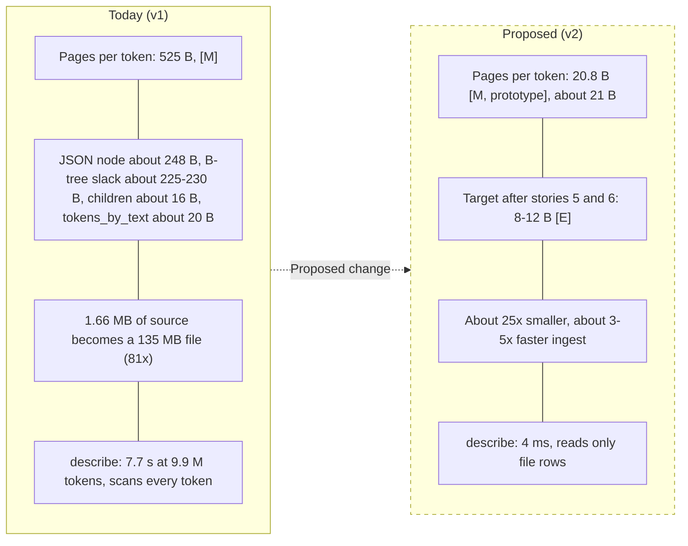
```mermaid
flowchart LR
    subgraph NOW["Today (v1)"]
        direction TB
        N1["Pages per token: 525 B, [M]"]
        N2["JSON node about 248 B, B-tree slack about 225-230 B, children about 16 B, tokens_by_text about 20 B"]
        N3["1.66 MB of source becomes a 135 MB file (81x)"]
        N4["describe: 7.7 s at 9.9 M tokens, scans every token"]
        N1 --- N2 --- N3 --- N4
    end
    subgraph PROP["Proposed (v2)"]
        direction TB
        P1["Pages per token: 20.8 B [M, prototype], about 21 B"]
        P2["Target after stories 5 and 6: 8-12 B [E]"]
        P3["About 25x smaller, about 3-5x faster ingest"]
        P4["describe: 4 ms, reads only file rows"]
        P1 --- P2 --- P3 --- P4
    end
    NOW -.->|"Proposed change"| PROP
    style PROP stroke-dasharray: 5 5
```

---

## 5. System overview: crates and dependencies

**Built today.** The workspace (ADR 0002) has a core crate with no storage, a store crate on redb, a CLI, and a language extractor. Arrows point from a crate to the crate it depends on (from the `Cargo.toml` files). Everything is pure Rust; CI enforces it.

**How to read it:** follow arrows downward; `graph-core` depends on nothing in the workspace. The shaded box is the pure-Rust boundary. Dashed items are proposed.

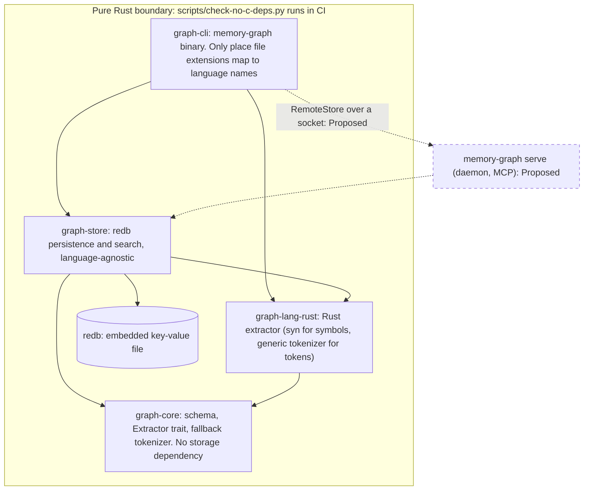
```mermaid
flowchart TD
    subgraph PURE["Pure Rust boundary: scripts/check-no-c-deps.py runs in CI"]
        CLI["graph-cli: memory-graph binary. Only place file extensions map to language names"]
        LANG["graph-lang-rust: Rust extractor (syn for symbols, generic tokenizer for tokens)"]
        STORE["graph-store: redb persistence and search, language-agnostic"]
        CORE["graph-core: schema, Extractor trait, fallback tokenizer. No storage dependency"]
        REDB[("redb: embedded key-value file")]
        CLI --> STORE
        CLI --> LANG
        STORE --> CORE
        STORE --> LANG
        LANG --> CORE
        STORE --> REDB
    end
    SERVE["memory-graph serve (daemon, MCP): Proposed"]
    SERVE -.-> STORE
    CLI -.->|"RemoteStore over a socket: Proposed"| SERVE
    style SERVE stroke-dasharray: 5 5
```

`graph-lang-rust` is registered on a `Store` with `Store::register`; languages without an extractor use the fallback tokenizer. The store crate lists `graph-lang-rust` as a dependency in `Cargo.toml` alongside `graph-core`.

---

## 6. Ingest of one file (today)

**Built today.** `memory-graph index` reads files, picks a language and an extractor, and the store turns the extractor output into rows. The store, not the extractor, works out parents from span containment.

**How to read it:** time flows downward. Each column is a participant. The single write transaction at the end is what makes a file replace atomic.

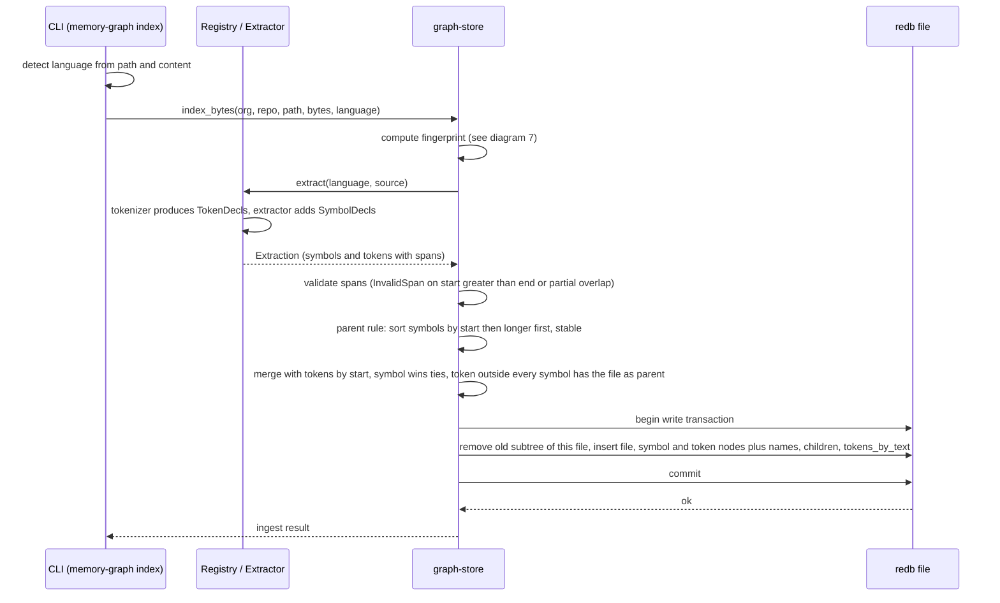
```mermaid
sequenceDiagram
    participant CLI as CLI (memory-graph index)
    participant Reg as Registry / Extractor
    participant Store as graph-store
    participant redb as redb file
    CLI->>CLI: detect language from path and content
    CLI->>Store: index_bytes(org, repo, path, bytes, language)
    Store->>Store: compute fingerprint (see diagram 7)
    Store->>Reg: extract(language, source)
    Reg->>Reg: tokenizer produces TokenDecls, extractor adds SymbolDecls
    Reg-->>Store: Extraction (symbols and tokens with spans)
    Store->>Store: validate spans (InvalidSpan on start greater than end or partial overlap)
    Store->>Store: parent rule: sort symbols by start then longer first, stable
    Store->>Store: merge with tokens by start, symbol wins ties, token outside every symbol has the file as parent
    Store->>redb: begin write transaction
    Store->>redb: remove old subtree of this file, insert file, symbol and token nodes plus names, children, tokens_by_text
    Store->>redb: commit
    redb-->>Store: ok
    Store-->>CLI: ingest result
```

---

## 7. Re-index with the fingerprint skip (today)

**Built today (PR #8).** Each file node stores a fingerprint. If a re-index computes the same fingerprint, the file's subtree is not touched and only `origin` is refreshed.

**How to read it:** the `alt` box has two outcomes. The fingerprint changes when the content, the language, `Extractor::version()` or `FINGERPRINT_FORMAT_VERSION` changes.

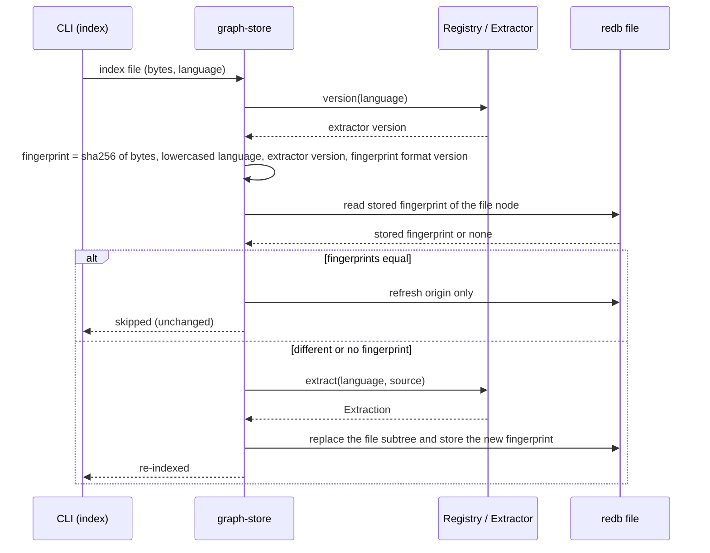
```mermaid
sequenceDiagram
    participant CLI as CLI (index)
    participant Store as graph-store
    participant Reg as Registry / Extractor
    participant redb as redb file
    CLI->>Store: index file (bytes, language)
    Store->>Reg: version(language)
    Reg-->>Store: extractor version
    Store->>Store: fingerprint = sha256 of bytes, lowercased language, extractor version, fingerprint format version
    Store->>redb: read stored fingerprint of the file node
    redb-->>Store: stored fingerprint or none
    alt fingerprints equal
        Store->>redb: refresh origin only
        Store-->>CLI: skipped (unchanged)
    else different or no fingerprint
        Store->>Reg: extract(language, source)
        Reg-->>Store: Extraction
        Store->>redb: replace the file subtree and store the new fingerprint
        Store-->>CLI: re-indexed
    end
```

`index --prune` removes only files marked `origin = directory`; `index-file` files are never pruned unless a directory run re-indexes them.

---

## 8. Search with roll-up by grain

**Built today for v1, proposed for v2.** A search by exact text can report hits at token, symbol, file, repo or org grain (a "roll-up" groups hits by ancestor and counts them). In v1 each hit and each ancestor is a decoded JSON node; in v2 the file/repo/org grains read only the `(term, content_id) -> count` postings and never decode a stream.

**How to read it:** the two `alt` branches are the two designs. In v2, token and symbol grain (or class filters) still decode the streams of files that have postings. Order is deterministic: `(org, repo, file path, start_byte, ordinal)`.

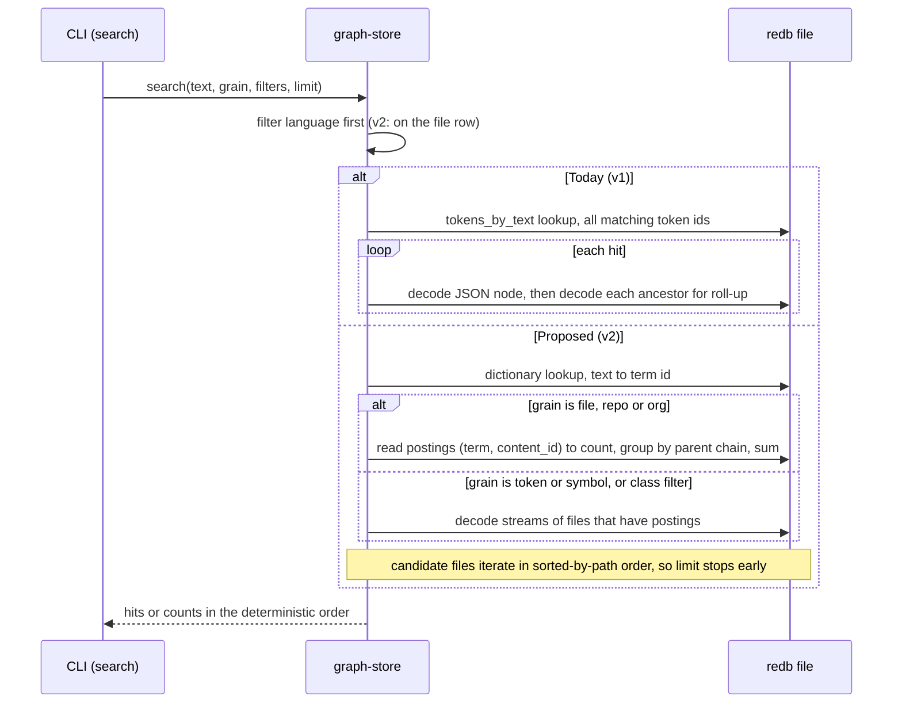
```mermaid
sequenceDiagram
    participant CLI as CLI (search)
    participant Store as graph-store
    participant redb as redb file
    CLI->>Store: search(text, grain, filters, limit)
    Store->>Store: filter language first (v2: on the file row)
    alt Today (v1)
        Store->>redb: tokens_by_text lookup, all matching token ids
        loop each hit
            Store->>redb: decode JSON node, then decode each ancestor for roll-up
        end
    else Proposed (v2)
        Store->>redb: dictionary lookup, text to term id
        alt grain is file, repo or org
            Store->>redb: read postings (term, content_id) to count, group by parent chain, sum
        else grain is token or symbol, or class filter
            Store->>redb: decode streams of files that have postings
        end
        Note over Store,redb: candidate files iterate in sorted-by-path order, so limit stops early
    end
    Store-->>CLI: hits or counts in the deterministic order
```

Measured for `(` at 9.9 M tokens [M]: org grain 2,409 ms today versus 6.5 ms with postings; token grain 11,261 ms versus 588 ms.

---

## 9. describe and filter validation

**Today it scans; v2 reads file rows.** Every CLI `search` or `symbols` runs `describe` first to validate `--kind` and `--symbol-kind` (`validate_filters`). Today that is O(tokens): 134 ms of the ~215-261 ms per CLI call on the corpus DB [M]. ADR story 0 (1 day) puts per-file counters on the file row so no scan is needed.

**How to read it:** the counters live on the file row (token count, symbol count, per-class and per-symbol-kind counts). Per-language totals are sums of file rows, which gives `RepoInfo.languages[..].symbol_kinds`.

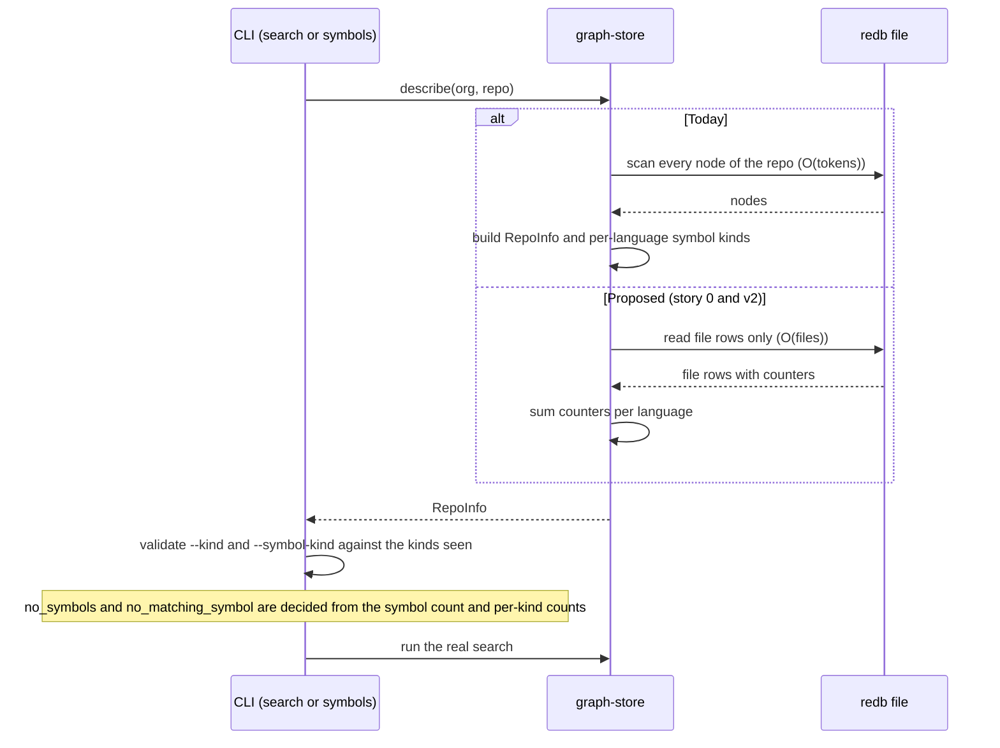
```mermaid
sequenceDiagram
    participant CLI as CLI (search or symbols)
    participant Store as graph-store
    participant redb as redb file
    CLI->>Store: describe(org, repo)
    alt Today
        Store->>redb: scan every node of the repo (O(tokens))
        redb-->>Store: nodes
        Store->>Store: build RepoInfo and per-language symbol kinds
    else Proposed (story 0 and v2)
        Store->>redb: read file rows only (O(files))
        redb-->>Store: file rows with counters
        Store->>Store: sum counters per language
    end
    Store-->>CLI: RepoInfo
    CLI->>CLI: validate --kind and --symbol-kind against the kinds seen
    Note over CLI: no_symbols and no_matching_symbol are decided from the symbol count and per-kind counts
    CLI->>Store: run the real search
```

---

## 10. Snapshot open, pin and retry (proposed)

**Proposed (ADR 0003, D3).** A reader wants one consistent view across all shards. redb can only open a read transaction on a file's latest committed state, so the reader opens every shard's read transaction eagerly, then checks that each shard's `commit_epoch` matches the manifest. If not, it drops everything and retries.

**How to read it:** the loop is the retry. It gives up after up to 5 s (configurable, jittered backoff from 1 ms) with `SnapshotUnavailable`. A writer that has committed but not yet published a manifest is the usual reason to retry.

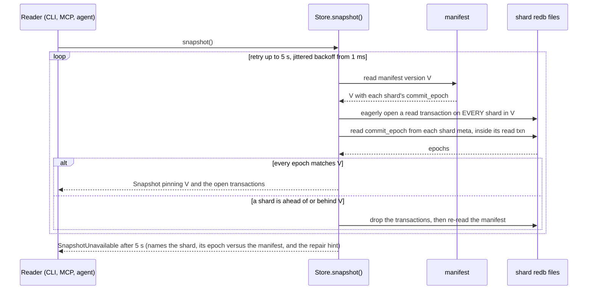
```mermaid
sequenceDiagram
    participant Reader as Reader (CLI, MCP, agent)
    participant Store as Store.snapshot()
    participant M as manifest
    participant S as shard redb files
    Reader->>Store: snapshot()
    loop retry up to 5 s, jittered backoff from 1 ms
        Store->>M: read manifest version V
        M-->>Store: V with each shard's commit_epoch
        Store->>S: eagerly open a read transaction on EVERY shard in V
        Store->>S: read commit_epoch from each shard meta, inside its read txn
        S-->>Store: epochs
        alt every epoch matches V
            Store-->>Reader: Snapshot pinning V and the open transactions
        else a shard is ahead of or behind V
            Store->>S: drop the transactions, then re-read the manifest
        end
    end
    Store-->>Reader: SnapshotUnavailable after 5 s (names the shard, its epoch versus the manifest, and the repair hint)
```

Consequences: one open read transaction per shard for the snapshot's whole life; reader-held pages block page reuse and `vacuum` on every shard the snapshot holds. Q6 default (still open): max snapshot age 15 minutes, then `SnapshotExpired`. Within a single shard a snapshot is just a redb read transaction.

---

## 11. Chunked ingest with batch_id (proposed)

**Proposed (ADR 0003).** A big repo index can be several redb commits (chunks, default every 64 MiB). `commit_epoch` is bumped once, at the final chunk. Each file is replaced atomically inside one chunk, but there is **no repo-level atomic visibility**: a reader in the middle sees some files new and some old.

**How to read it:** the writer stamps each chunk with the run's `batch_id` and `meta.open_batch`; a reader takes its snapshot between chunks, passes the epoch check, and sees the repo flagged `in_progress`.

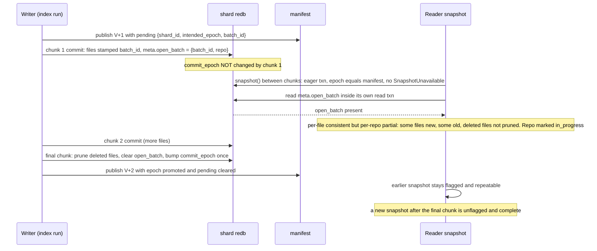
```mermaid
sequenceDiagram
    participant W as Writer (index run)
    participant S as shard redb
    participant M as manifest
    participant R as Reader snapshot
    W->>M: publish V+1 with pending {shard_id, intended_epoch, batch_id}
    W->>S: chunk 1 commit: files stamped batch_id, meta.open_batch = {batch_id, repo}
    Note over S: commit_epoch NOT changed by chunk 1
    R->>S: snapshot() between chunks: eager txn, epoch equals manifest, no SnapshotUnavailable
    R->>S: read meta.open_batch inside its own read txn
    S-->>R: open_batch present
    Note over R: per-file consistent but per-repo partial: some files new, some old, deleted files not pruned. Repo marked in_progress
    W->>S: chunk 2 commit (more files)
    W->>S: final chunk: prune deleted files, clear open_batch, bump commit_epoch once
    W->>M: publish V+2 with epoch promoted and pending cleared
    R->>R: earlier snapshot stays flagged and repeatable
    Note over R: a new snapshot after the final chunk is unflagged and complete
```

---

## 12. Crash recovery and manifest states (proposed)

**Proposed (ADR 0003).** redb commits are durable and cannot be undone, so rollback is impossible and **recovery always rolls forward**. The writer first publishes a "pending" intent, so after a crash `repair` knows what was meant to happen.

**How to read it:** states describe one shard in the manifest. The normal path is the top row; the crash paths lead to repair. `repair` runs under the exclusive writer lock on writer open and on demand with `memory-graph repair`.

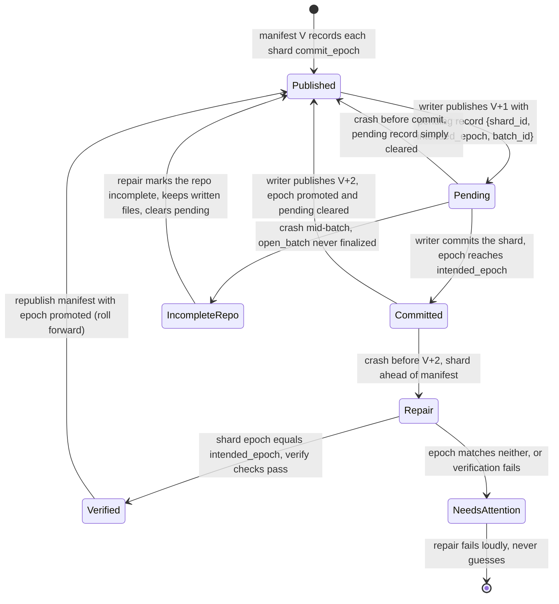
```mermaid
stateDiagram-v2
    [*] --> Published : manifest V records each shard commit_epoch
    Published --> Pending : writer publishes V+1 with pending record {shard_id, intended_epoch, batch_id}
    Pending --> Committed : writer commits the shard, epoch reaches intended_epoch
    Committed --> Published : writer publishes V+2, epoch promoted and pending cleared
    Pending --> Published : crash before commit, pending record simply cleared
    Committed --> Repair : crash before V+2, shard ahead of manifest
    Repair --> Verified : shard epoch equals intended_epoch, verify checks pass
    Verified --> Published : republish manifest with epoch promoted (roll forward)
    Repair --> NeedsAttention : epoch matches neither, or verification fails
    Pending --> IncompleteRepo : crash mid-batch, open_batch never finalized
    IncompleteRepo --> Published : repair marks the repo incomplete, keeps written files, clears pending
    NeedsAttention --> [*] : repair fails loudly, never guesses
```

An `incomplete` repo is resumed by the next `index` run: files whose fingerprint already matches are skipped, and a new batch id finalizes the epoch. `routing_change {repo, from, to}` (move/rebalance) is applied in V+2 with the epoch promotion.

---

## 13. Crash and repair sequence (proposed)

**Proposed (ADR 0003, story 14).** What actually happens, step by step, when a writer dies between committing a shard and publishing the manifest.

**How to read it:** the reader never repairs; it only reports the hint. Repair is idempotent and only publishes through the atomic manifest rename.

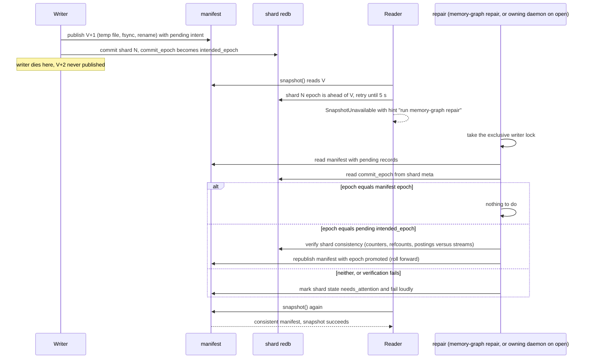
```mermaid
sequenceDiagram
    participant W as Writer
    participant M as manifest
    participant S as shard redb
    participant R as Reader
    participant Rep as repair (memory-graph repair, or owning daemon on open)
    W->>M: publish V+1 (temp file, fsync, rename) with pending intent
    W->>S: commit shard N, commit_epoch becomes intended_epoch
    Note over W: writer dies here, V+2 never published
    R->>M: snapshot() reads V
    R->>S: shard N epoch is ahead of V, retry until 5 s
    R-->>R: SnapshotUnavailable with hint "run memory-graph repair"
    Rep->>Rep: take the exclusive writer lock
    Rep->>M: read manifest with pending records
    Rep->>S: read commit_epoch from shard meta
    alt epoch equals manifest epoch
        Rep->>Rep: nothing to do
    else epoch equals pending intended_epoch
        Rep->>S: verify shard consistency (counters, refcounts, postings versus streams)
        Rep->>M: republish manifest with epoch promoted (roll forward)
    else neither, or verification fails
        Rep->>M: mark shard state needs_attention and fail loudly
    end
    R->>M: snapshot() again
    M-->>R: consistent manifest, snapshot succeeds
```

---

## 14. Sharding layout and search fan-out (proposed)

**Proposed and specified but not built (ADR 0003, stories 13-17).** A shard is one redb file holding whole repos (partition key `(org, repo)`: an org may span shards, a repo never does). Each shard has its own dictionary, streams, postings and rows. A search asks every shard in parallel and merges the answers.

**How to read it:** the manifest routes each `(org, repo)` to a shard. The k-way merge uses the same deterministic key as a single shard, so results are identical.

```mermaid
flowchart TD
    MAN["manifest (small file, atomically replaced): shards {shard_id, path, state, repos, commit_epoch, format versions} and routing (org, repo) to shard_id"]
    subgraph SH1["Shard 1 (one redb file)"]
        D1["Dictionary 1"]
        R1["Repos A, B: rows, streams, postings"]
    end
    subgraph SH2["Shard 2 (one redb file)"]
        D2["Dictionary 2"]
        R2["Repos C, D: rows, streams, postings"]
    end
    SHN["Shard N (up to 1,024 shards, 10 bits in the id)"]
    MAN -.-> SH1
    MAN -.-> SH2
    MAN -.-> SHN
    Q["Search: text"]
    Q --> T1["Resolve text to a term id in each shard (per-shard dictionaries)"]
    T1 -.-> SH1
    T1 -.-> SH2
    SH1 --> MERGE["k-way merge by (org, repo, path, start_byte, ordinal), roll-up counts summed by group key"]
    SH2 --> MERGE
    MERGE --> LIM["limit applied after the merge, each shard yields at most limit rows"]
```

Ids (ADR): entities `tag(1) | shard(10) | local(53)`; tokens `1 | shard(10) | file_local(28) | ordinal(25)`, emitted as JSON strings. Fan-out routes strictly by the manifest routing table, never by presence. Split threshold example: 200 M tokens or 20 GB (Q4, still open). An unavailable shard fails the query unless a partial result is explicitly requested.

---

## 15. Q5 options: today versus a daemon (proposed / awaiting decision)

**Left: built today. Right: Proposed / awaiting decision (Q5 is a blocking user decision).** redb takes an exclusive `flock(LOCK_EX | LOCK_NB)` on open, so a second process cannot even read while another holds the file; it gets `DatabaseAlreadyOpen`, which `graph-store` reports as `StoreError::Locked`. The paper recommends (a) an owning daemon with (b) retry as the fallback, but this is a recommendation, not a decision.

**How to read it:** first diagram is today; second is the recommendation, where the CLI talks to one owner process and falls back to opening the file itself if none is running.

Today (built):

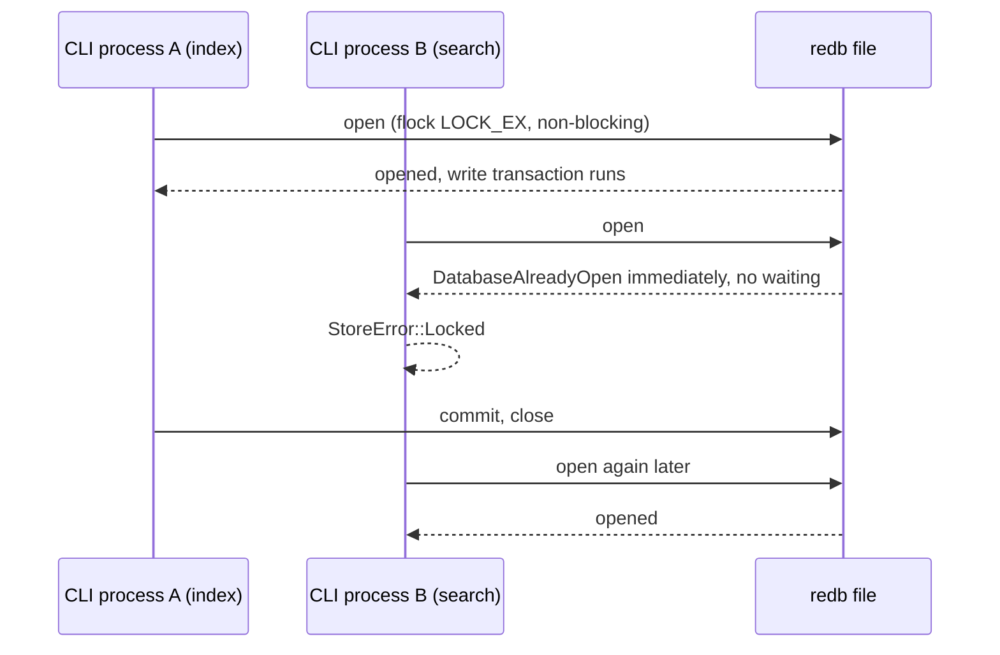
```mermaid
sequenceDiagram
    participant Idx as CLI process A (index)
    participant Srch as CLI process B (search)
    participant redb as redb file
    Idx->>redb: open (flock LOCK_EX, non-blocking)
    redb-->>Idx: opened, write transaction runs
    Srch->>redb: open
    redb-->>Srch: DatabaseAlreadyOpen immediately, no waiting
    Srch-->>Srch: StoreError::Locked
    Idx->>redb: commit, close
    Srch->>redb: open again later
    redb-->>Srch: opened
```

Proposed / awaiting decision (`memory-graph serve`, socket, `RemoteStore`, fallback):

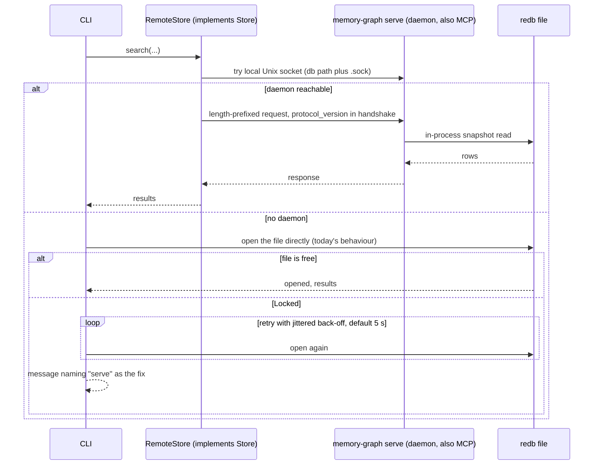
```mermaid
sequenceDiagram
    participant CLI as CLI
    participant Remote as RemoteStore (implements Store)
    participant D as memory-graph serve (daemon, also MCP)
    participant redb as redb file
    CLI->>Remote: search(...)
    Remote->>D: try local Unix socket (db path plus .sock)
    alt daemon reachable
        Remote->>D: length-prefixed request, protocol_version in handshake
        D->>redb: in-process snapshot read
        redb-->>D: rows
        D-->>Remote: response
        Remote-->>CLI: results
    else no daemon
        CLI->>redb: open the file directly (today's behaviour)
        alt file is free
            redb-->>CLI: opened, results
        else Locked
            loop retry with jittered back-off, default 5 s
                CLI->>redb: open again
            end
            CLI-->>CLI: message naming "serve" as the fix
        end
    end
```

Details from the paper: the daemon holds every shard's exclusive lock, does `repair` on start, and would be the MCP server; `RemoteStore` calls the same `Store` trait so the differential oracle stays valid; estimated cost 6-9 days (not in the ADR's current 45-47 day core). Direct-open with retry gives availability between writes only, not a snapshot guarantee.

---

## 16. Versioning and migration (proposed)

**Proposed (ADR 0003, D2, story 9 and 12).** `schema_version` means the on-disk layout (tables and key encoding) and is checked at open. Components have their own format versions in `meta`. Moving v1 to v2 is `memory-graph migrate`, which writes a new file, verifies it, and only then renames it into place; the source is never modified.

**How to read it:** first the "open" checks, then the migrate run. Any verification failure leaves both source and target untouched. `SCHEMA_VERSION` is 1 in the code today.

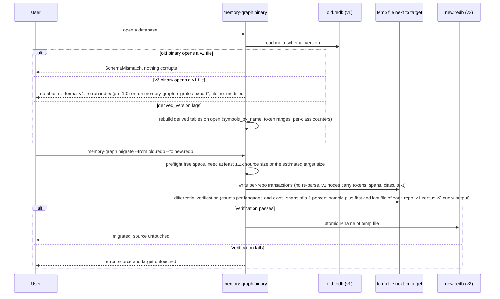
```mermaid
sequenceDiagram
    participant U as User
    participant Bin as memory-graph binary
    participant Src as old.redb (v1)
    participant Tmp as temp file next to target
    participant Dst as new.redb (v2)
    U->>Bin: open a database
    Bin->>Src: read meta schema_version
    alt old binary opens a v2 file
        Bin-->>U: SchemaMismatch, nothing corrupts
    else v2 binary opens a v1 file
        Bin-->>U: "database is format v1, re-run index (pre-1.0) or run memory-graph migrate / export", file not modified
    else derived_version lags
        Bin->>Bin: rebuild derived tables on open (symbols_by_name, token ranges, per-class counters)
    end
    U->>Bin: memory-graph migrate --from old.redb --to new.redb
    Bin->>Bin: preflight free space, need at least 1.2x source size or the estimated target size
    Bin->>Tmp: write per-repo transactions (no re-parse, v1 nodes carry tokens, spans, class, text)
    Bin->>Tmp: differential verification (counts per language and class, spans of a 1 percent sample plus first and last file of each repo, v1 versus v2 query output)
    alt verification passes
        Bin->>Dst: atomic rename of temp file
        Bin-->>U: migrated, source untouched
    else verification fails
        Bin-->>U: error, source and target untouched
    end
```

Per-component versions in `meta`: `stream_format`, `postings_format`, `dictionary_format`, `fingerprint_format`, `derived_version` (redefines today's `symbol_index_version`). Estimated 1-2 minutes per 10 M tokens [E]. Export path: `memory-graph export --format ndjson`. The migration framework is a **gate: it must exist and be tested before 1.0 is tagged.**

---

## 17. Delivery roadmap: ADR 0003 stories

**Proposed plan (ADR 0003 story table).** Days are ideal developer-days including tests. The ADR gives the milestone order (story 0, then store trait, then the v2 checkpoint, then packed dictionary and postings) but no full dependency list, so the arrows below are the ADR's stated order plus obvious "needs the thing before it" links; treat them as a reading aid.

**How to read it:** boxes are stories with days. Groups match the ADR totals: core (0-12) about 45-47 days, sharding (13-17) 27 days, optional 18 and 19, all together about 78-80 days. Dashed boxes are the optional stories.

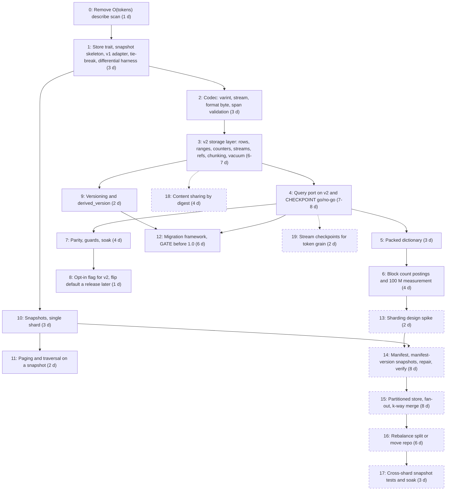
```mermaid
flowchart TD
    S0["0: Remove O(tokens) describe scan (1 d)"]
    S1["1: Store trait, snapshot skeleton, v1 adapter, tie-break, differential harness (3 d)"]
    S2["2: Codec: varint, stream, format byte, span validation (3 d)"]
    S3["3: v2 storage layer: rows, ranges, counters, streams, refs, chunking, vacuum (6-7 d)"]
    S4["4: Query port on v2 and CHECKPOINT go/no-go (7-8 d)"]
    S5["5: Packed dictionary (3 d)"]
    S6["6: Block count postings and 100 M measurement (4 d)"]
    S7["7: Parity, guards, soak (4 d)"]
    S8["8: Opt-in flag for v2, flip default a release later (1 d)"]
    S9["9: Versioning and derived_version (2 d)"]
    S10["10: Snapshots, single shard (3 d)"]
    S11["11: Paging and traversal on a snapshot (2 d)"]
    S12["12: Migration framework, GATE before 1.0 (6 d)"]
    S13["13: Sharding design spike (2 d)"]
    S14["14: Manifest, manifest-version snapshots, repair, verify (8 d)"]
    S15["15: Partitioned store, fan-out, k-way merge (8 d)"]
    S16["16: Rebalance split or move repo (6 d)"]
    S17["17: Cross-shard snapshot tests and soak (3 d)"]
    S18["18: Content sharing by digest (4 d)"]
    S19["19: Stream checkpoints for token grain (2 d)"]

    S0 --> S1 --> S2 --> S3 --> S4
    S4 --> S5 --> S6
    S4 --> S7 --> S8
    S3 --> S9
    S1 --> S10 --> S11
    S9 --> S12
    S4 --> S12
    S6 --> S13 --> S14 --> S15 --> S16 --> S17
    S10 --> S14
    S3 -.-> S18
    S4 -.-> S19

    style S18 stroke-dasharray: 5 5
    style S19 stroke-dasharray: 5 5
    style S13 stroke-dasharray: 5 5
    style S14 stroke-dasharray: 5 5
    style S15 stroke-dasharray: 5 5
    style S16 stroke-dasharray: 5 5
    style S17 stroke-dasharray: 5 5
```

Totals: core 0-12 about **45-47 d** (the single-shard re-baseline, stories 0-4, 7, 8, is 25-27 d; stories 5, 6, 9-12 add 20 d); sharding 13-17 **27 d**; with everything **about 78-80 d**. Story 10 waits on the Q5 decision. The Q5 daemon (paper estimate 6-9 d) is not in these totals.
